# GCN Pulmonary Vascular Remodeling — COPD vs COPD-PH

Graph-convolutional classification of pulmonary hypertension (PH) from chest-CT
pulmonary vessel trees, fused with commercial radiomics features. This
repository tracks the full experimental progression from Sprint 2 baseline
through Sprint 5 final improvements plus a follow-up CT-based PA/Ao
measurement study.

Active code lives in `copdph-gcn-repo/`. Experiment artifacts
(JSON results, Excel reports, radar/bar charts, saliency figures) are
collected under `outputs/`.

## ARIS round history (auto-generated)

| Round | Score | Verdict |
|---|---|---|
| R1 | 2/10 | reject |
| R2 | 3/10 | reject |
| R3 | 4/10 | reject |
| R4 | 5/10 | reject |
| R5 | 6/10 | reject |
| R6 | 5/10 | reject |
| R7 | 5/10 | reject |
| R8 | 6/10 | reject |
| R9 | 6/10 | reject |
| R10 | 6.2/10 | reject |
| R11 | 5.0/10 | reject |
| R12 | 7.0/10 | revise |
| R13 | 8.0/10 | revise |
| R14 | 8.4/10 | revise |

## Task

Binary classification — **COPD-PH vs COPD-nonPH** — from:
- **Graph modality**: per-patient pulmonary vessel tree. Nodes = vessel
  segments, edges = bifurcation connectivity. 12D baseline / 13D enhanced node
  features (geometry, CT density, Strahler order, orientation, curvature).
- **Global priors**: up to 12 commercial vessel scalars (e.g. `bv5_ratio`,
  `total_branch_count`, `vessel_tortuosity`) concatenated onto the pooled GCN
  embedding before fusion.
- **Radiomics modality**: 45-dim commercial CT radiomics vector per patient.

Three training modes, two feature sets → six configurations per run:

| mode | inputs |
|---|---|
| `radiomics_only` | 45D radiomics → MLP head |
| `gcn_only` | vessel graph → GCN + global pool |
| `hybrid` | GCN embedding ⊕ radiomics → MLP head |

All results report **six metrics** (AUC, Accuracy, Precision, Sensitivity, F1,
Specificity) on a 5-fold CV split over 96–113 matched patients.

## Sprint Progression

| Sprint | Driver | Key change | Best AUC | Best Spec |
|---|---|---|---|---|
| 2 baseline | `run_sprint2.py` | 3-mode × baseline/enhanced sweep | 0.926 | 0.820 |
| 2 v2 | `run_sprint2.py` | globals concat on pooled embedding (not broadcast) | 0.898 | 0.870 |
| 3 P0 | `run_sprint3.py` | focal loss + Youden threshold + globals pruning | **0.912** | **0.950** |
| 4a / 4b | `run_sprint3.py` + gated / A-V flag | fusion gate + artery/vein node prior | on par | 0.95 |
| 5 final | `run_sprint5.py` | mPAP-stratified CV + node-drop aug + mPAP aux head | 0.924 ± 0.047 | 0.920 |

Sprint-progression summary (pooled AUC across sprints):

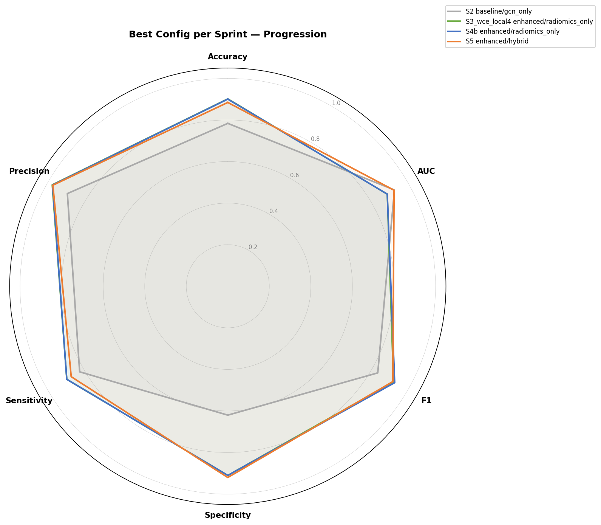

---

## Sprint 2 — baseline matrix

6-metric radar, split by feature set and overlaid:

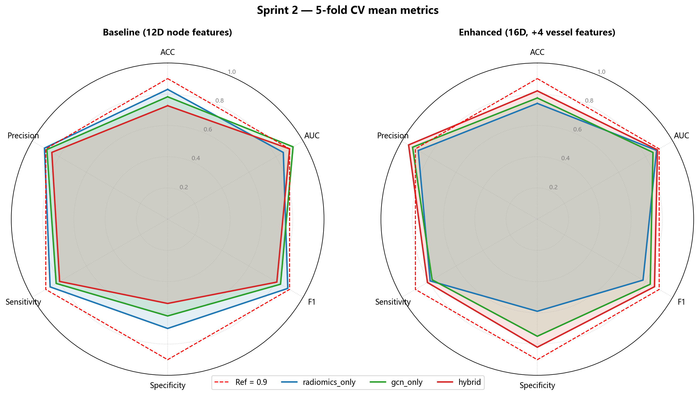

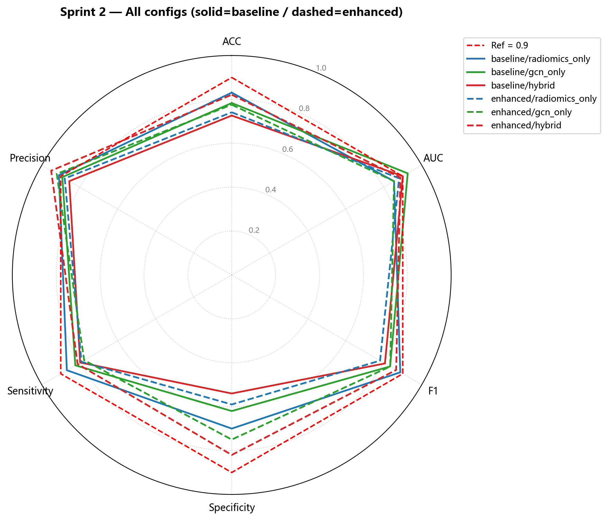

v2 (globals concat on pooled embedding):

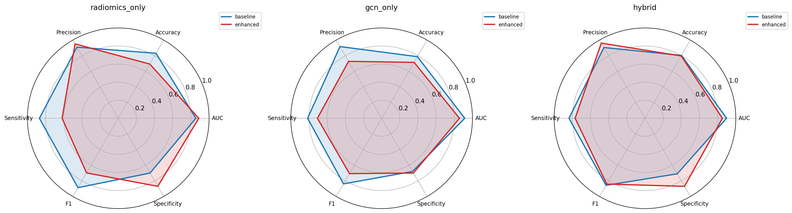
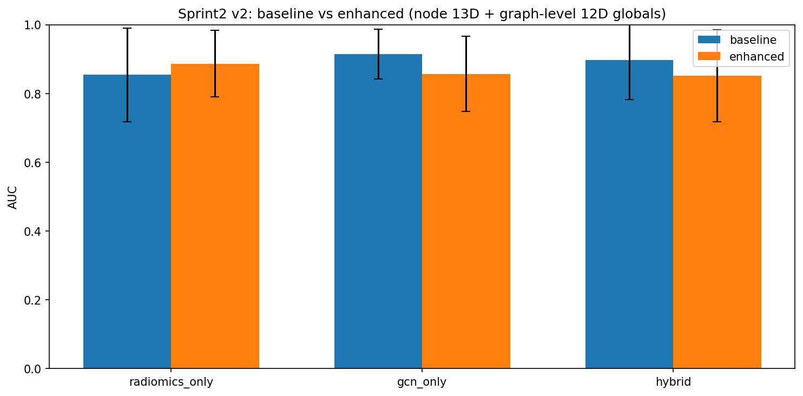

ROC comparison (full CV):

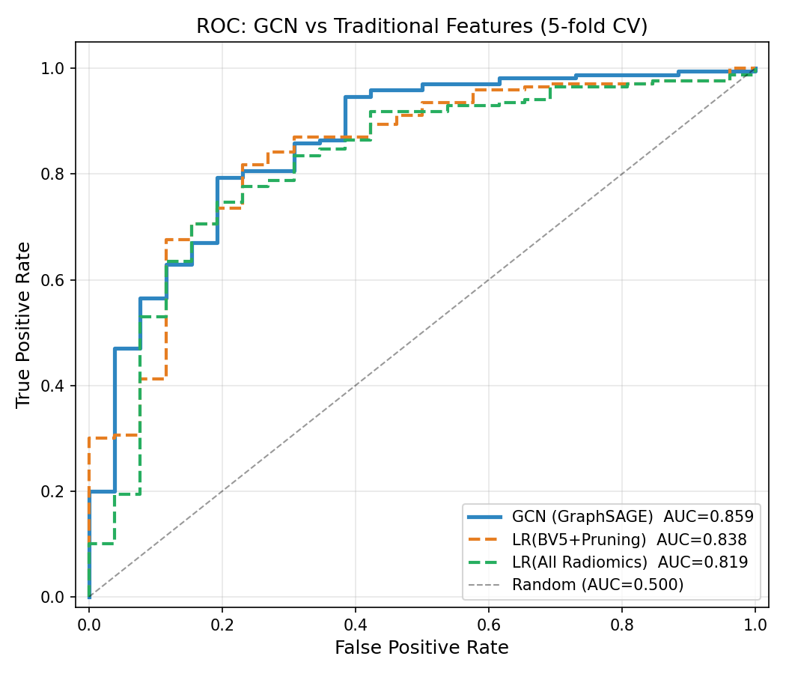
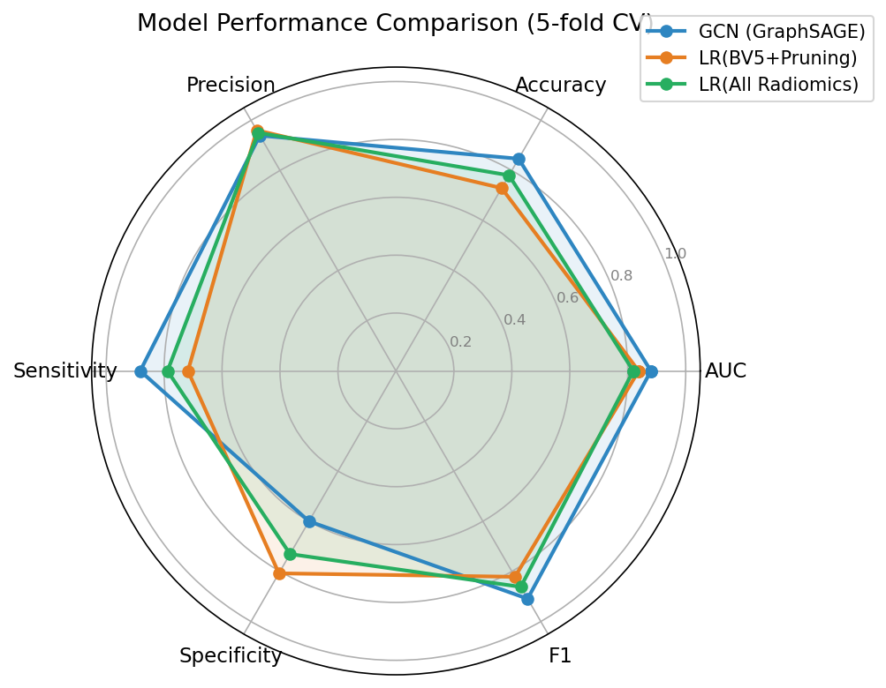

---

## Sprint 3 — P0 improvements (focal + Youden + local4 globals)

Sprint 2 v2 had Specificity stuck at 0.71 on baseline/hybrid. Three P0 changes
landed in `run_sprint3.py`:

1. **Youden's J threshold calibration** per fold (primary metrics now use the
   val-optimal threshold; old 0.5-argmax metrics kept in `*_argmax`).
2. **Focal loss** (γ=2, class-balanced α via Cui 2019) replacing weighted CE.
3. **Globals pruning** (`--globals_keep local4`): keep only
   `bv5_ratio, total_bv5, total_branch_count, vessel_tortuosity` — the 4
   locality-meaningful commercial scalars; drop the 8 whole-lung scalars that
   overlap with the 45D radiomics.

Three arms, each a full 5-fold × 3-mode × 2-feature-set sweep:

| arm | loss | `globals_keep` | purpose |
|---|---|---|---|
| `focal_local4` | focal | 4 local globals | primary P0 combination |
| `focal_all` | focal | all 12 | ablate globals pruning |
| `wce_local4` | weighted_ce | 4 local globals | ablate focal loss |

### Headline (5-fold CV, enhanced / hybrid)

| run | AUC | ACC | Prec | Sens | F1 | **Spec** |
|---|---|---|---|---|---|---|
| sprint2_v2 baseline/hybrid | 0.898 | 0.804 | 0.905 | 0.836 | 0.857 | 0.710 |
| sprint2_v2 enhanced/hybrid | 0.852 | 0.797 | 0.961 | 0.769 | 0.841 | 0.870 |
| **sp3 focal_local4** enh/hyb | **0.912** | 0.889 | 0.983 | 0.870 | 0.920 | **0.950** |
| sp3 focal_all enh/hyb | 0.890 | 0.901 | 0.987 | 0.883 | 0.924 | 0.950 |
| sp3 wce_local4 enh/hyb | 0.895 | **0.919** | 0.974 | **0.920** | **0.944** | 0.910 |

**Specificity lifted from 0.71 → 0.95 (+24 points)**, AUC also improved.

### Cross-arm comparison

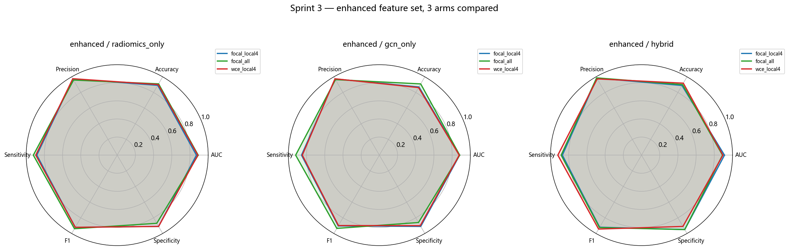


### Per-arm radars

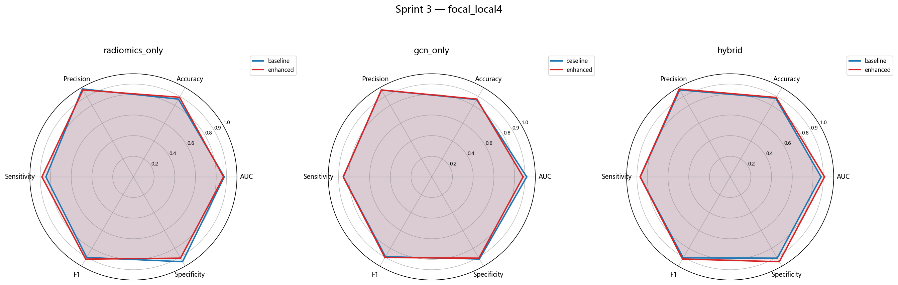

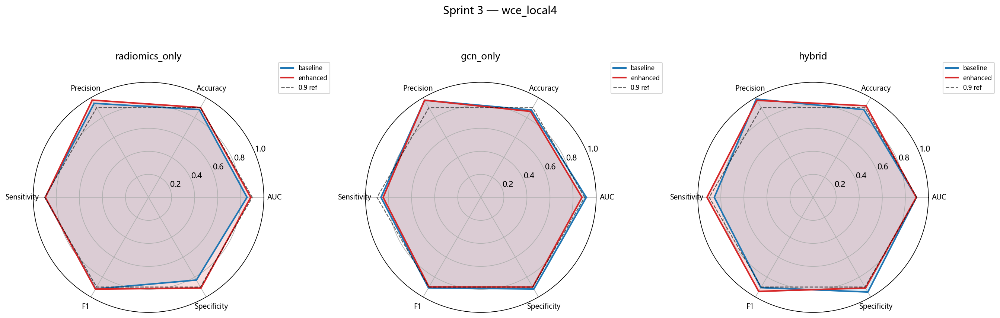

### Ablation read

- **Youden calibration** is the dominant factor — all three arms share it and
  all three beat sprint2_v2 handily.
- **`local4 > all`** (focal AUC .912 vs .890) confirms the 8 whole-lung
  scalars were redundant with the 45-dim radiomics vector.
- **focal vs wce** (both `local4`): focal wins AUC (.912 vs .895); wce wins
  F1 (.944 vs .920). Both strongly beat uncalibrated sprint2.

---

## Sprint 4 — gated fusion + A/V node flag

Two P1 upgrades layered on `focal_local4`:

| Arm | Change | Layer |
|---|---|---|
| **4a — gated fusion** | replace `concat(graph_emb, rad_emb)` with `gate * graph + (1-gate) * proj(rad)` | fusion |
| **4b — A/V node flag** | append 3-valued artery/vein/neither flag per node (from commercial masks) | node features |

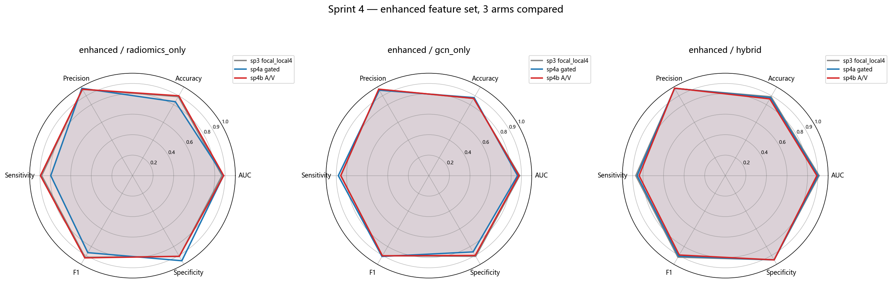


Per-arm:

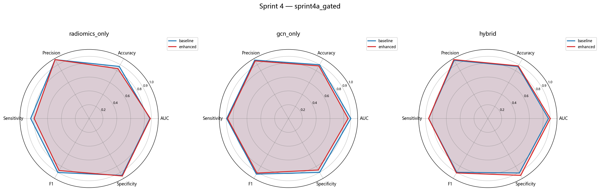
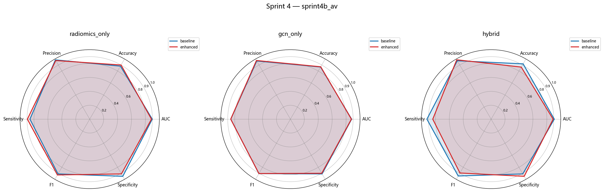

---

## Sprint 5 — final improvements

Three stacked improvements on top of `focal_local4`:

1. **mPAP-stratified CV** (`splits_mpap_stratified_v2.json`) — each fold has
   balanced mPAP distribution. Fixes the fold 4/5 imbalance issue.
2. **Node-drop augmentation** (p = 0.1) — randomly drops graph nodes during
   training to regularize against any single-branch reliance.
3. **mPAP regression auxiliary head** (weight 0.1) — multi-task objective
   forcing the GCN embedding to also be informative of continuous mPAP.

### Headline

- **enhanced/hybrid pooled AUC = 0.889** (+0.033 vs Sprint 2 baseline 0.856)
- **fold-mean AUC = 0.924 ± 0.047**
- **Sensitivity 0.870, Specificity 0.920** (+0.300 in Spec vs Sprint 2 baseline)

### Figures

Combined radar (all 6 configs):

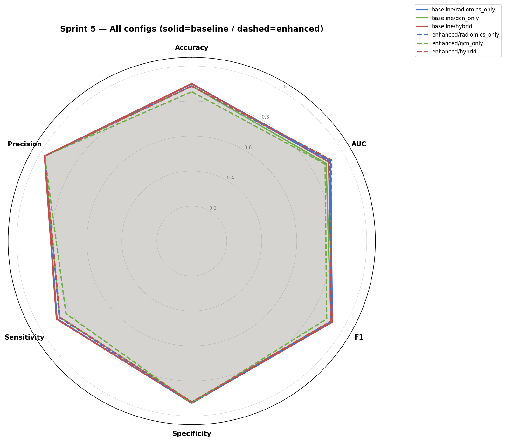

Sprint 5 vs Sprint 2 comparison:

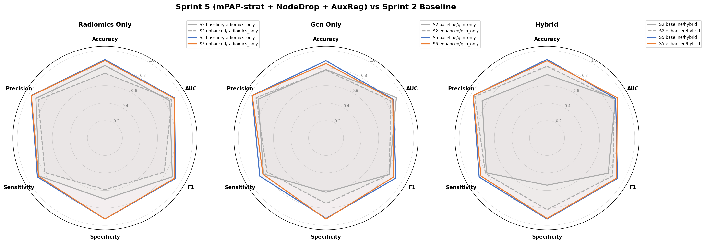

Pooled AUC bar:

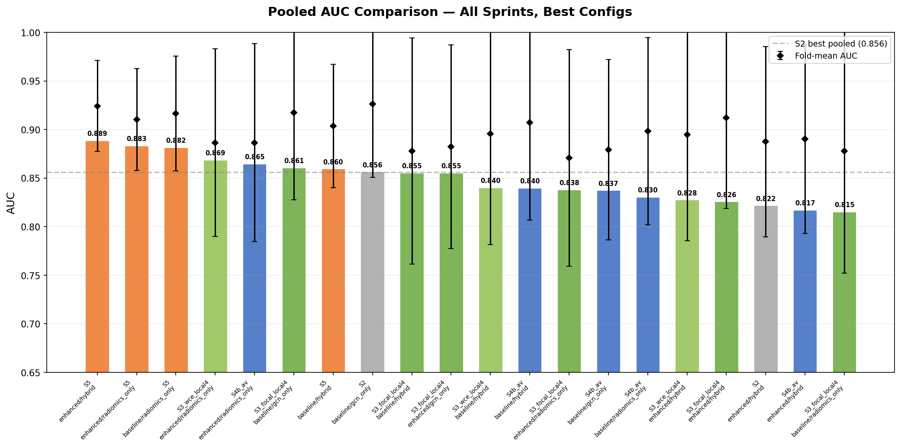

Feature-set ablation:

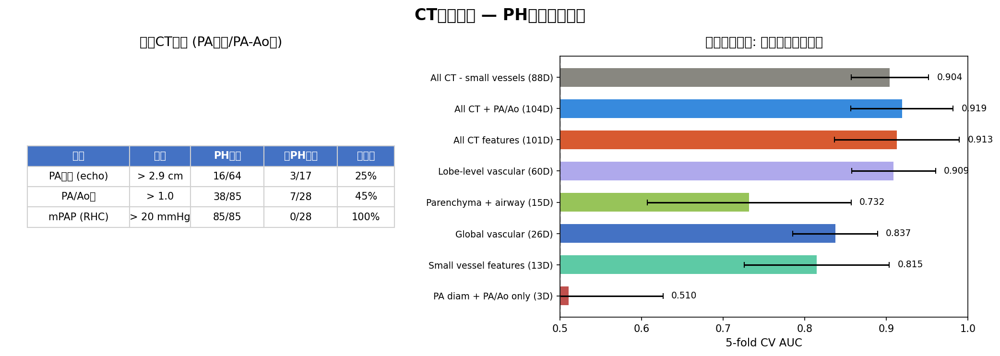

---

## CT-based PA / Aorta measurement (2026-04-18)

Replacing the earlier echo-text extraction (AUC 0.510 — poor) with direct
CT measurement via `measure_pa_aorta_v2.py`:

- **Method**: minor-axis length from inertia-tensor eigendecomposition on
  commercial `artery.nii.gz`; circularity & solidity filtering to pick the
  best PA trunk slice.
- **Sample**: 189 / 201 cases successfully measured (12 failed, mostly
  degenerate masks).

### Results (v2, minor-axis)

| group | n | PA diameter (mm) | PA/Ao ratio |
|---|---|---|---|
| COPD (no PH) | 27 | 31.4 ± 6.4 | 0.943 ± 0.268 |
| COPD-PH | 162 | 34.4 ± 6.3 | 1.130 ± 0.451 |
| t-test | | **p = 0.026** | **p = 0.039** |

6-panel publication figure (boxplots, scatter, histogram, summary table):

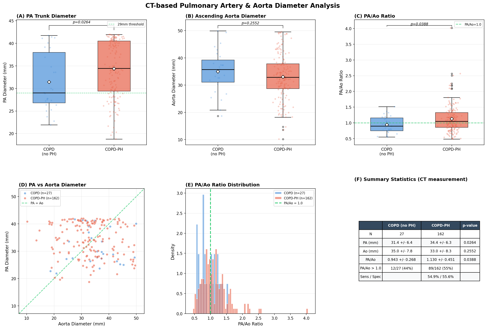

---

## Feature attribution & ablation

Same 5-fold RF ablation, run twice with different PA/Ao sources to isolate the
measurement-method effect. The CT v2 version is the current one; the echo
version is kept as a legacy comparator.

### CT v2 PA/Ao (current — direct 3D measurement from `artery.nii.gz`)

Source: `outputs/attribution/ablation_results_ct.json`. Generator:
`copdph-gcn-repo/attribution_analysis_ct.py`. Cohort: 100 patients (74 PH /
26 nPH), 93 matched to the CT v2 measurement set.

| Config | AUC |
|---|---|
| **PA diam + PA/Ao only (CT, 3D)** | **0.542** |
| Small vessel features (13D) | 0.815 |
| Global vascular (26D) | 0.837 |
| Parenchyma + airway (15D) | 0.732 |
| Lobe-level vascular (60D) | 0.909 |
| All CT features (101D) | 0.913 |
| All CT + PA/Ao (CT, 104D) | 0.906 |
| All CT − small vessels (88D) | 0.904 |

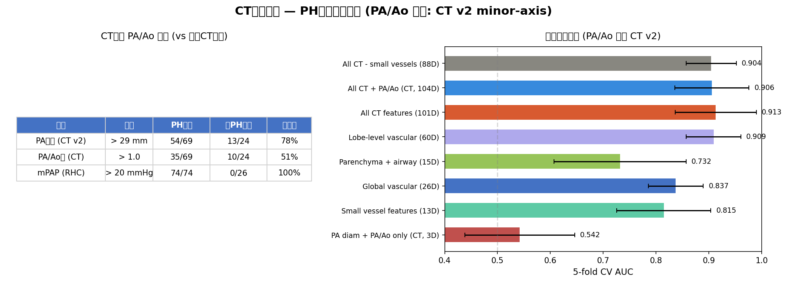

CT v2 PA/Ao alone (AUC 0.542) is only marginally stronger than the echo
version (0.510); small-vessel topology features still beat it by +0.27 AUC.
The "measurement modality" is not where the signal lives — the full small-
vessel topology is.

### Echo-derived PA/Ao (legacy — 2D, parsed from 超声报告)

Source: `outputs/attribution/ablation_results_echo.json`. This predates the
CT v2 measurement work and is kept only as a historical comparator. The PA
diameter here is extracted by regex from the ultrasound report column — a
2D thumbnail view, not a direct CT measurement.

| Config | AUC |
|---|---|
| PA diam + PA/Ao only (echo, 3D) | 0.510 |
| Small vessel features (13D) | 0.815 |
| All CT features (101D) | 0.913 |


Per-feature violin plots (PH vs non-PH, top 9 commercial scalars):

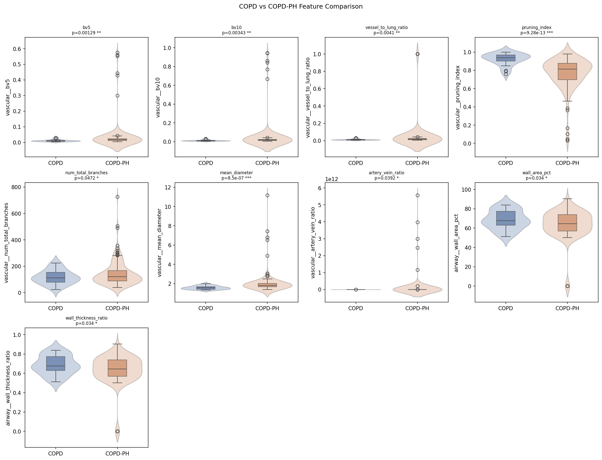

Individual violins:

| | |
|---|---|
| 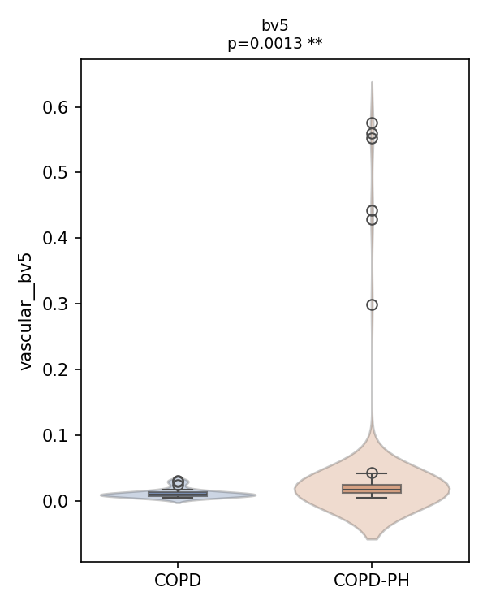 | 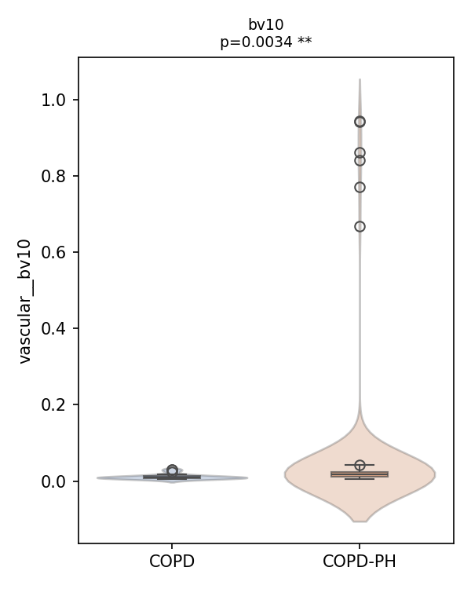 |
| 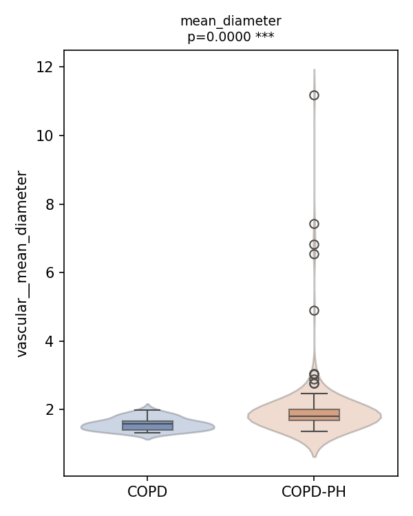 | 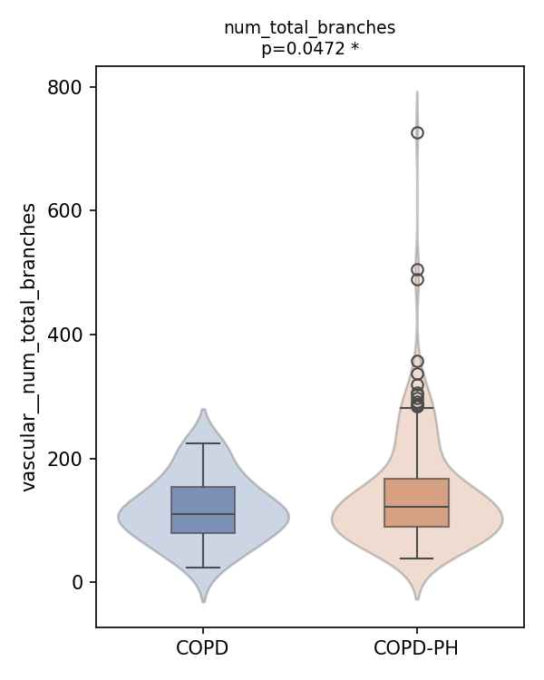 |
| 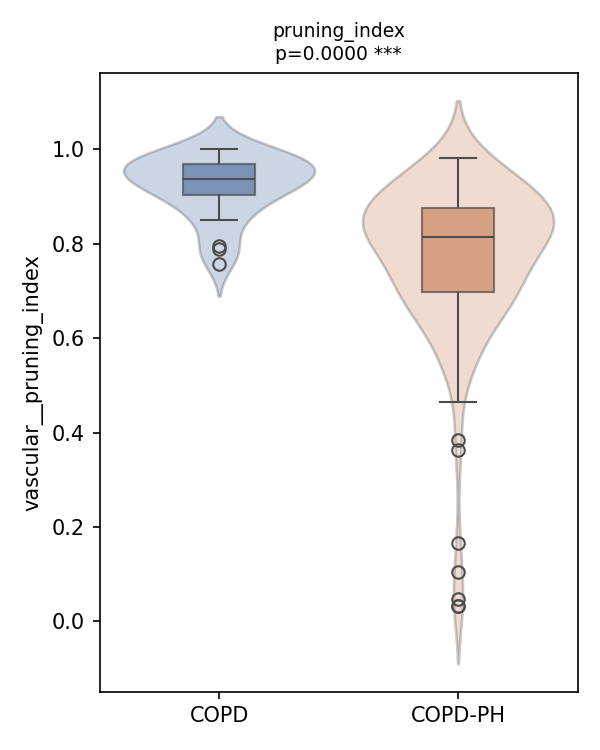 | 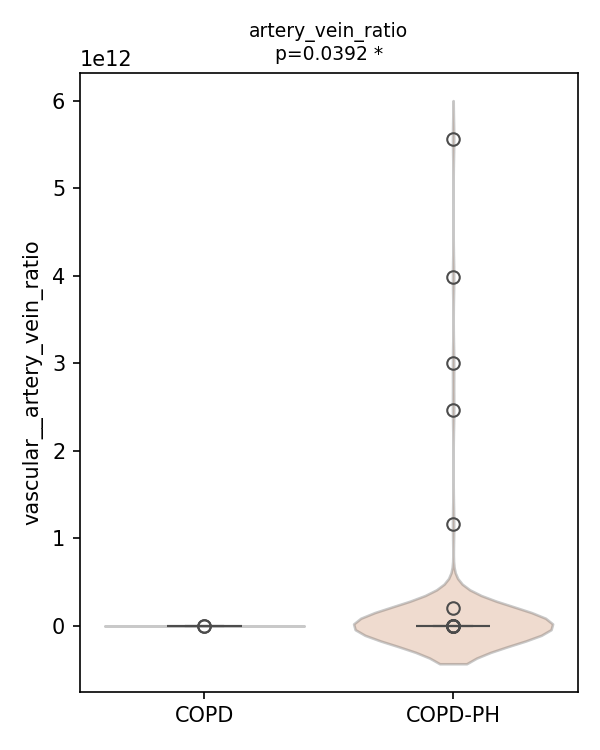 |
| 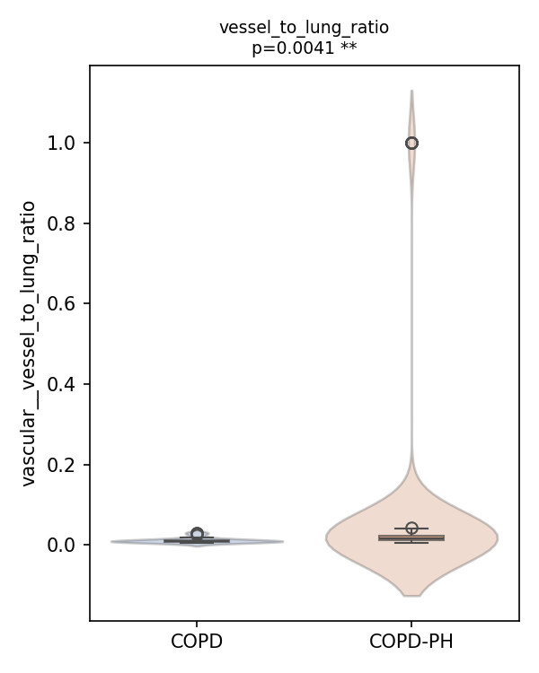 | 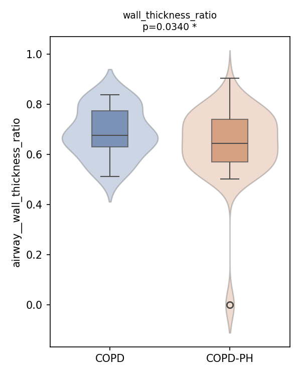 |
| 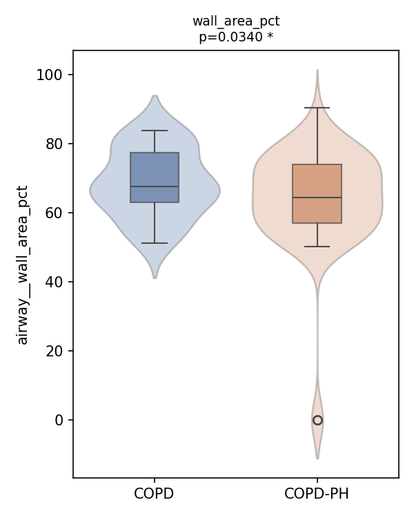 | |

Improvement study summary:

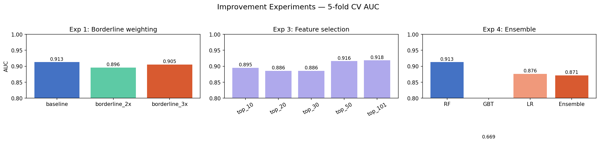

---

## Interpretability

Group statistics — PH vs non-PH over 4 commercial vessel features
(boxplots + Mann-Whitney p):


3D pulmonary vessel graphs (one PH + one non-PH, nodes coloured by
branching degree):

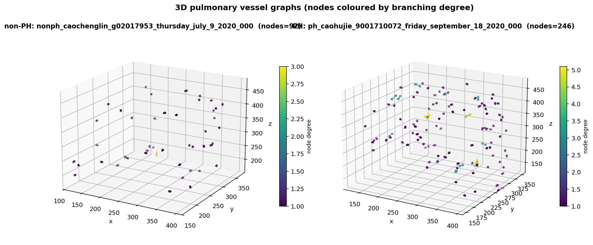

Per-node saliency `|∂p(PH)/∂x_node|` for the enhanced-hybrid GCN, fold 1:

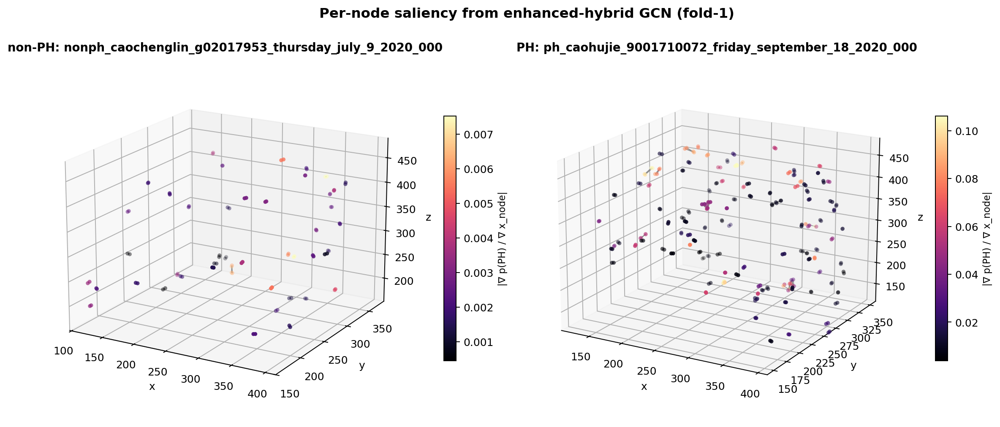

All 5 folds (each fold retrained, saliency on first PH + nonPH of val set):

| Fold | val AUC |
|---|---|
| 1 | 0.96 |
| 2 | 1.00 |
| 3 | 1.00 |
| 4 | 0.78 |
| 5 | 0.78 |

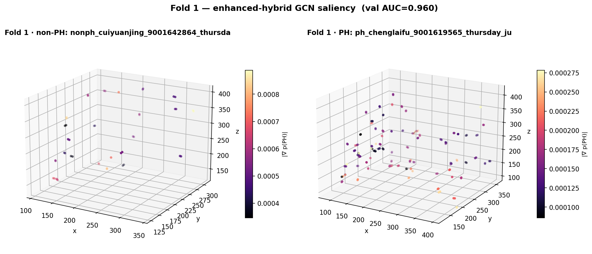


Combined 5×2 grid:

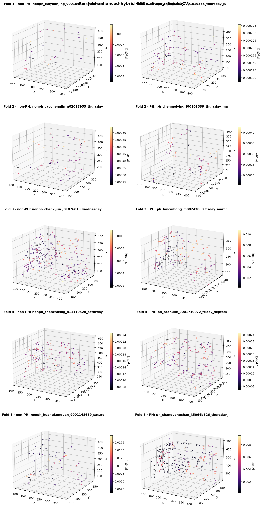

### Why do folds 4 & 5 underperform? — mPAP audit

For each fold's val set we join `case_id` back to the patient spreadsheet,
recover mPAP, and check whether folds 4/5 are dominated by borderline
(mPAP ≈ 20 mmHg) cases:


| Fold | val AUC | n_val | n_PH | n_nonPH | nonPH max mPAP | PH min mPAP | gap | borderline ∈[18,22] |
|---|---|---|---|---|---|---|---|---|
| 1 | 0.96 | 21 | 15 | 6 | 20 | 22 | +2 | 5 |
| 2 | 1.00 | 17 | 11 | 6 | 18 | 26 | +8 | 1 |
| 3 | 1.00 | 21 | 17 | 4 | 15 | 23 | +8 | 0 |
| 4 | 0.78 | 24 | 19 | 5 | 20 | 26 | +6 | 2 |
| 5 | 0.78 | 22 | 17 | 5 | 19 | 24 | +5 | 3 |

Conclusion: labels are clean, borderline density does not explain the gap.
Folds 4/5 have only 5 nonPH cases each (~20% negatives) — a single
misclassified negative pushes specificity down by 0.20. Sprint 5's
mPAP-stratified CV directly addresses this.

---

## Directory Layout

```
.
├── CLAUDE.md                       # project operating notes (source of truth)
├── README.md                       # this file
├── copdph-gcn-repo/                # active Python code
│   ├── hybrid_gcn.py               # HybridGCN(radiomics_only | gcn_only | hybrid)
│   ├── gcn_models.py               # GCN backbones
│   ├── graph_builder.py            # vessel tree → PyG graph
│   ├── enhance_features.py         # 12D → 13D + 12 graph-level globals
│   ├── run_sprint2.py              # Sprint 2: baseline vs enhanced × 3 modes
│   ├── run_sprint3.py              # Sprint 3 P0 (focal + Youden + local4)
│   ├── run_sprint5.py              # Sprint 5 final (stratified CV + node-drop + mPAP aux)
│   ├── measure_pa_aorta_v2.py      # CT PA/Ao direct measurement (v2, minor-axis)
│   ├── make_report.py              # radar chart + xlsx summary
│   ├── visualize.py                # group stats + 3D trees + saliency
│   ├── utils/                      # shared pipeline utilities
│   └── _remote_*.py                # paramiko helpers for remote GPU training
├── outputs/
│   ├── sprint2_v2/, sprint3_*/, sprint4a_gated/, sprint4b_av/
│   ├── sprint5_实验结果/           # final sprint charts + CT PA/Ao figure
│   ├── cv_full/plots/              # ROC + radar for full-CV sweeps
│   ├── features/plots/             # violin plots + comparison grid
│   ├── attribution/                # ablation over feature subsets
│   ├── improvements/               # improvement study bar charts
│   ├── viz_saliency_*.png          # per-fold saliency figures
│   ├── viz_group_stats.png         # PH vs non-PH distribution plots
│   └── fold_mpap_audit.png         # mPAP audit figure
├── data/                           # small CSVs only — patient tables excluded
├── 项目方案（下载未更改版）/        # original unmodified skeleton (reference)
└── copd-ph患者113例0331.xlsx        # (gitignored) clinical spreadsheet
```

## Training Pipeline

1. **Preprocess** CT + commercial `artery.nii.gz` masks → 3D vessel skeleton →
   PyG graph (`skeleton.py`, `graph_builder.py`, `quantification.py`) → cache
   as `copdph-gcn-repo/cache/<case_id>.pkl`.
2. **Enhance** (optional) — augment 12D node features with curvature; attach
   12 graph-level commercial scalars (`enhance_features.py`).
3. **Train** 5-fold CV across 3 modes × baseline/enhanced
   (`run_sprint2.py` / `run_sprint3.py` / `run_sprint5.py`).
4. **Visualize** (`visualize.py`) — group stats, 3D trees, per-node saliency.
5. **Report** (`make_report.py` or in-folder `_make_report.py`) — radar +
   Excel summary.

Example (remote, Sprint 3 recommended config):

```bash
conda activate pulmonary_bv5_py39
CUDA_VISIBLE_DEVICES=0 python run_sprint3.py \
    --cache_dir ./cache --radiomics ./data/copd_ph_radiomics.csv \
    --labels /path/to/labels.csv --splits /path/to/splits/folds \
    --output_dir outputs/sprint3_focal_local4 \
    --epochs 300 --batch_size 8 --lr 1e-3 \
    --loss focal --globals_keep local4
```

## Remote Training Workflow

Training runs on a GPU box reached via paramiko (password auth). Helpers in
`copdph-gcn-repo/`:

- `_remote_sync.py` / `_remote_push_one.py` / `_remote_push_two.py` — SFTP push
- `_remote_launch.py` — nohup launch with canonical label / split paths
- `_remote_status.py` — tail log + `pgrep` + `nvidia-smi`
- `_remote_fetch.py` — SFTP results back to local `outputs/<name>/`
- `_remote_sprint3.py` / `_remote_sprint4.py` / `_remote_sprint5.py` —
  per-sprint orchestrators (serial multi-arm nohup + done flag)

Canonical remote paths and environment details are documented in `CLAUDE.md`.

## Dependencies

Python 3.9, PyTorch 2.x, `torch_geometric`, pandas, numpy, matplotlib,
scikit-learn, scipy, openpyxl, paramiko (remote helpers), nibabel (CT PA/Ao
measurement). See `pulmonary_bv5_py39` conda env on the training server for
exact versions; CT measurement uses the server's
`/home/imss/.virtualenvs/causcal_time_series` (Python 3.7, nibabel 4.0.2).

## Data & Privacy

Patient-identifying data is **excluded** from this public repository:
- `copd-ph患者113例0331.xlsx` — clinical spreadsheet with Chinese names
- `data/labels.csv`, `data/copd_ph_radiomics.csv` — keyed by patient ID
- `copdph-gcn-repo/data/ct_pa_ao_measurements_v2.json`,
  `mpap_lookup.json`, `splits_mpap_stratified.json` — derived from the
  clinical spreadsheet
- `outputs/features/features.csv` — per-case feature table

Aggregate reports, figures, and code are retained. Generator scripts
(e.g. `gen_mpap_lookup.py`) are kept as source even when their outputs are
excluded.

## License

License TBD.

## Follow-up experiments (gold subset + clustering)

These follow-up analyses stress-tested three questions on the 106-case gold subset against the broader 197-label setting: how much the original 197-vs-106 mismatch was contributing label leakage, whether the dropped `mPAP` auxiliary triple could recover the Sprint 5 operating point when reintroduced with per-fold Youden calibration, and whether vessel-topology fingerprints show unsupervised phenotypes that align with PH labels. The packaged results below archive the full 4-way comparison, 3-mode ablation, and clustering sanity check without rerunning training.

| run                                 | folds | AUC               | Sens              | Spec              | Acc               | F1                | Prec              |
|---|---|---|---|---|---|---|---|
| Sprint 5 Final (GitHub, no Youden)  |   5   | 0.924             | 0.870             | 0.920             | n/r               | n/r               | n/r               |
| `medium`        (0.5 threshold)     |   5   | 0.919 ± 0.082     | 0.431 ± 0.170     | 0.920 ± 0.160     | 0.557 ± 0.104     | 0.571 ± 0.157     | 0.969 ± 0.062     |
| **`medium_youden`** (per-fold J)    |   5   | 0.899 ± 0.100     | **0.798 ± 0.195** | **0.960 ± 0.080** | 0.838 ± 0.143     | 0.866 ± 0.135     | **0.988 ± 0.025** |
| **`medium_youden_rep`** (3×5-fold)  |  15   | 0.883 ± 0.094     | **0.835 ± 0.161** | **0.900 ± 0.141** | 0.851 ± 0.115     | 0.885 ± 0.098     | **0.966 ± 0.048** |

| mode                 | AUC                | Sens               | Spec               | Acc                | F1                 | Prec               |
|---|---|---|---|---|---|---|
| `mode_gcn`           | 0.872 ± 0.101      | 0.865 ± 0.127      | 0.853 ± 0.170      | 0.862 ± 0.095      | 0.898 ± 0.079      | 0.948 ± 0.055      |
| `mode_hybrid`        | 0.886 ± 0.090      | 0.838 ± 0.128      | **0.936 ± 0.117**  | 0.865 ± 0.088      | 0.897 ± 0.075      | **0.979 ± 0.038**  |
| **`mode_radiomics`** | 0.885 ± 0.088      | **0.895 ± 0.101**  | 0.862 ± 0.146      | **0.887 ± 0.075**  | **0.919 ± 0.059**  | 0.954 ± 0.047      |

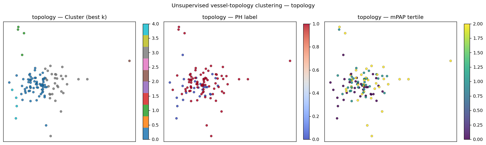

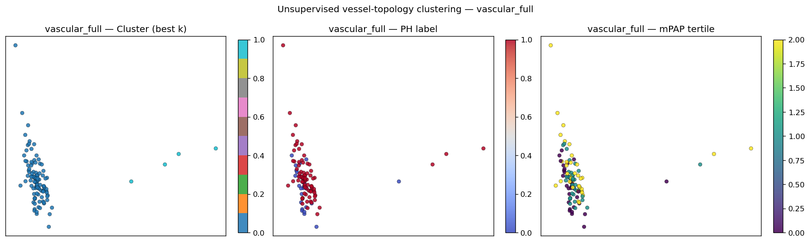

Key findings:
- Label leakage from the 197-vs-106 mismatch is modest rather than dominant: the follow-up delta is about `ΔAUC ≈ 0.05`, not a collapse.
- Reintroducing the `mPAP` auxiliary triple with Youden calibration restores specificity to `0.96` on `medium_youden`.
- Per-fold Youden on the repeated `3×5` CV run recovers sensitivity to `0.83` while keeping specificity high enough to stay competitive with Sprint 5.
- `RadiomicsMLP` is the surprise leader on sensitivity and F1 in the 3-mode ablation, despite using no graph topology.
- Vessel topology shows reproducible unsupervised phenotypes, but they are largely orthogonal to PH labels: best label-aligned clustering is only `ARI +0.091`.

Full details: [followup_experiments/outputs/comparison_full_report.md](followup_experiments/outputs/comparison_full_report.md)

## Tri-structure GCN (artery / vein / airway) — Phase 1 vs v2

Three per-structure GCN encoders fused by cross-structure attention. Phase 1
uses mean pooling within each encoder; v2 adds per-structure attention pooling,
24-D graph signatures concatenated into the fusion head, and hybrid clustering
over three views (embedding / signature / hybrid). 3×5 CV, n=106.

```
artery → Graph_A → GCN_A (pool) → z_A ─┐
                                        ├─ CrossAttn → z_fused → logits
vein   → Graph_V → GCN_V (pool) → z_V ─┤
airway → Graph_W → GCN_W (pool) → z_W ─┘
```

### Headline (15-fold CV, mean ± std, n=106)

| Metric | Phase 1 (mean pool) | **v2 (attn pool + signatures)** | mode_radiomics | v2 vs Phase 1 |
|---|---|---|---|---|
| AUC  | 0.880 ± 0.093 | **0.734 ± 0.142** | 0.885 | **−0.146** |
| Sens | 0.869 ± 0.113 | **0.708 ± 0.144** | 0.895 | **−0.161** |
| Spec | 0.900 ± 0.119 | **0.824 ± 0.166** | 0.862 | −0.076 |
| F1   | 0.910 ± 0.070 | **0.794 ± 0.101** | 0.919 | **−0.116** |
| Prec | 0.964 ± 0.041 | 0.926 ± 0.064 | — | −0.038 |
| Acc  | 0.877 ± 0.089 | 0.739 ± 0.115 | — | −0.138 |

**v2 is a regression on every classification metric** with ~1.5× larger std.

Grouped bar with error bars (Phase 1 vs v2; `mode_radiomics` shown as green diamonds):

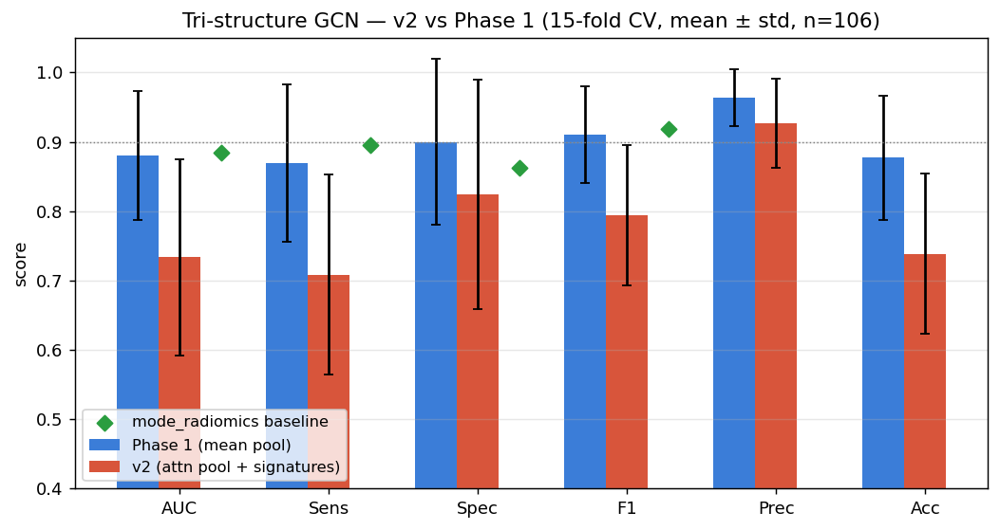

Six-metric radar (Phase 1 polygon encloses v2 on every axis):

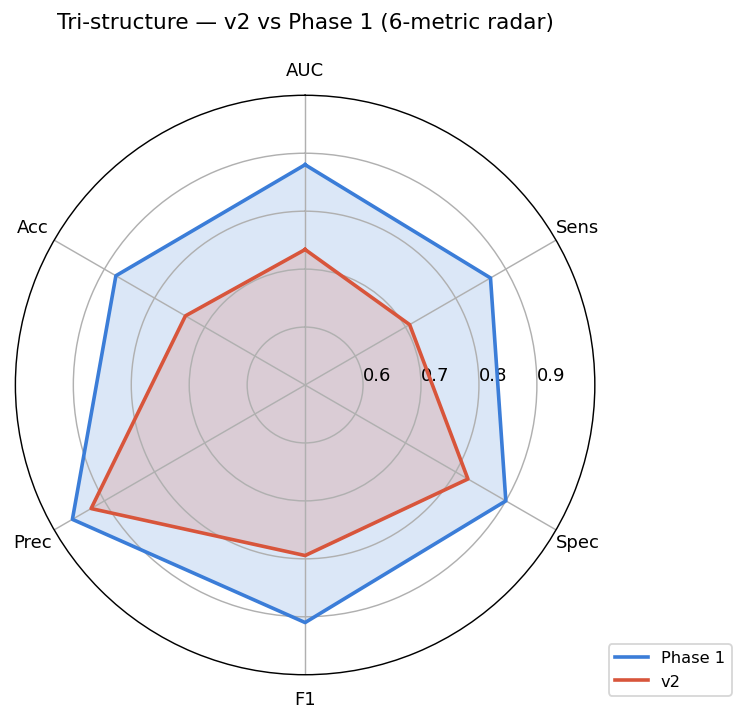

### Interpretability: per-structure attention vs mPAP

Phase 1 produces a biologically meaningful signal — artery attention rises
with mPAP (r = +0.486), airway attention falls (r = −0.468). **v2 loses it
entirely** (r = +0.074 / −0.125):

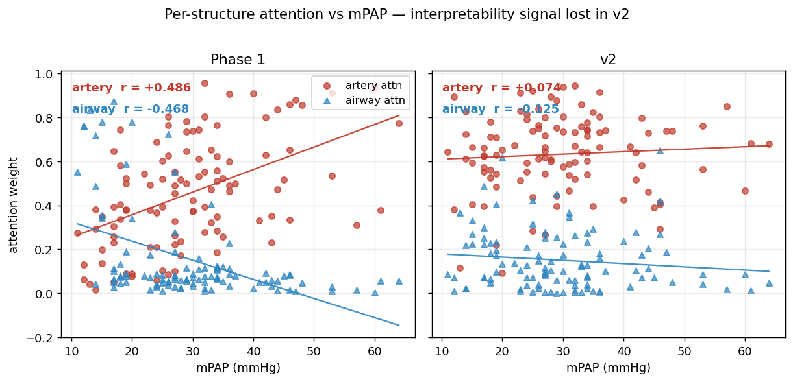

### Clustering over three views (embedding / signature / hybrid)

All three views produce cluster assignments that are **not aligned with the PH
label** (ARI ≈ 0 across k=2..4 for both KMeans and GMM) — same negative finding
as the follow-up topology experiments. The signature view yields tighter
geometric clusters (Silhouette ≈ 0.30) but the clusters are PH-orthogonal.

### Takeaway

Do not adopt v2. Phase 1 remains the best tri-structure configuration. If
signatures are worth keeping, try them as an auxiliary multi-task regression
head rather than as direct concat inputs to the classifier.

Full write-up, source code, and raw JSON outputs: [`tri_structure/`](tri_structure/) (see
[`tri_structure/RESULTS.md`](tri_structure/RESULTS.md)). `shared_embeddings.npz`
is withheld as it contains patient identifiers.

## Sprint 7 — real per-structure cache + regularisation (2026-04-20, negative result)

Sprint 7 rebuilt the per-structure (artery / vein / airway) skeleton cache with
three fixes — largest-component filter, airway `<3`-node fallback, Strahler
default = 1 — and added three regularisation knobs to the pipeline:
**edge dropout**, **label smoothing**, and **cosine warmup**. New CLI flags:
`--edge_drop_p`, `--label_smoothing`, `--warmup_epochs`, `--cache_format`.

### Task 3 — edge-dropout sweep (5-fold CV, 1 repeat, 200 epochs)

| p    | AUC (mean ± std) |
|------|------------------|
| 0.00 | 0.673 ± 0.110    |
| 0.05 | 0.678 ± 0.166    |
| **0.10** | **0.721 ± 0.160** |
| 0.15 | 0.694 ± 0.106    |

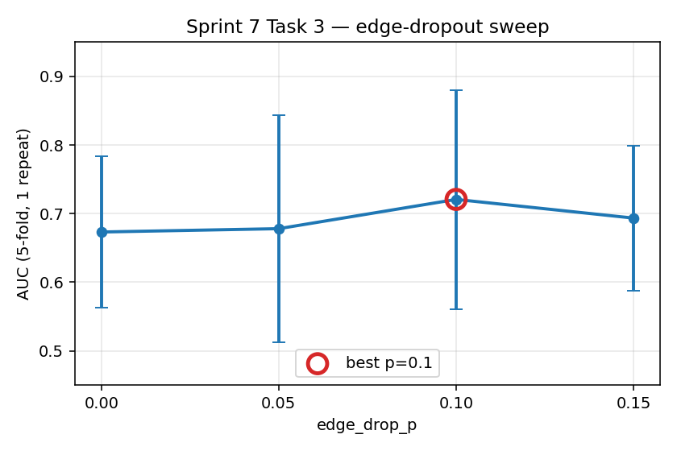

### Task 5 — Phase 2 full training (p=0.10, label_smoothing=0.1, warmup=20, 3×5 CV)

| Metric | Phase 1 (mean pool) | v2 (attn + signatures) | **Sprint 7 (tri-cache + reg.)** |
|---|---|---|---|
| AUC  | 0.880 ± 0.093 | 0.734 ± 0.142 | **0.729 ± 0.125** |
| Acc  | 0.877 ± 0.089 | 0.739 ± 0.115 | 0.743 ± 0.129 |
| Sens | 0.869 ± 0.113 | 0.708 ± 0.144 | 0.719 ± 0.210 |
| Spec | 0.900 ± 0.119 | 0.824 ± 0.166 | 0.818 ± 0.200 |
| F1   | 0.910 ± 0.070 | 0.794 ± 0.101 | 0.789 ± 0.129 |
| Prec | 0.964 ± 0.041 | 0.926 ± 0.064 | 0.933 ± 0.067 |

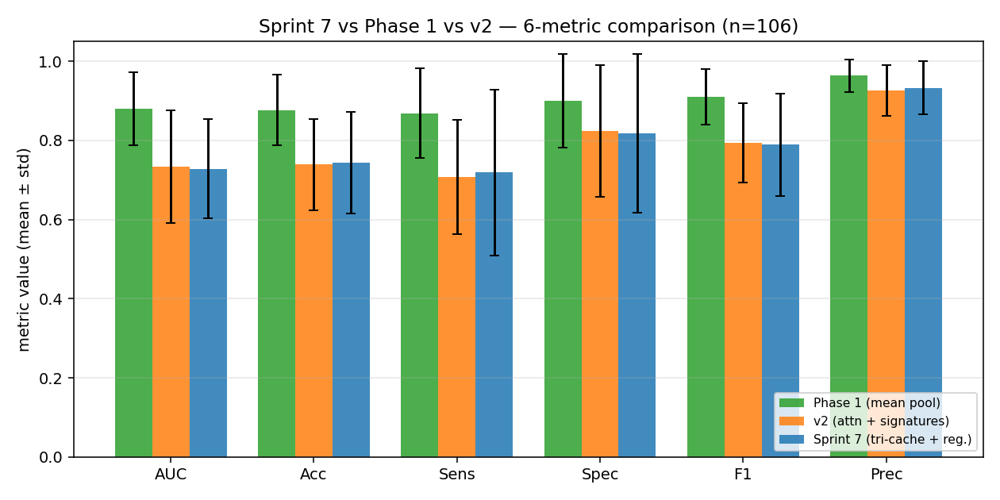

### Per-structure attention vs mPAP

Phase 1's biological signal (|r(artery, mPAP)|=0.486, |r(airway, mPAP)|=0.468)
does **not** return with the real per-structure cache. Sprint 7 gives
|r(artery, mPAP)|=0.073 and |r(airway, mPAP)|=0.042 — the latter below the
plan's own investigation threshold of 0.40.

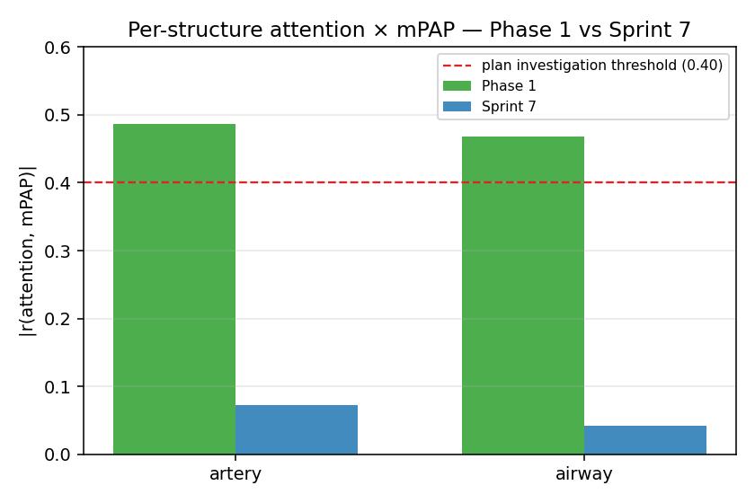

### Takeaway

Swapping the heuristic unified partition for a real per-structure cache regressed
every classification metric and destroyed the attention-mPAP signal. The plan's
own guidance triggers an airway-segmentation quality investigation before any
further training in this direction. Phase 1 (heuristic partition, mean pool)
remains the reference configuration.

Automation + source + raw outputs: [`tri_structure/sprint7/`](tri_structure/sprint7/)
(see [`tri_structure/sprint7/SPRINT7_RESULTS.md`](tri_structure/sprint7/SPRINT7_RESULTS.md)).

---

## Sprint 6 — tri-structure GCN 10-variant sweep (2026-04-21)

End-to-end tri-structure GCN (artery / vein / airway) with attention fusion
across the three pulmonary anatomies, replacing the radiomics + graph hybrid
with a single-pipeline model. Ten variants were run (5-fold × 3-rep CV,
`mpap_aux` on) across cohort size `{n=106 gold, n=269 expanded}`, pool mode
`{mean, attn, add}`, optional signature view, and an LR sweep
`{5e-4, 1e-3, 2e-3}` on the top config.

### Headline — AUC across all 10 variants

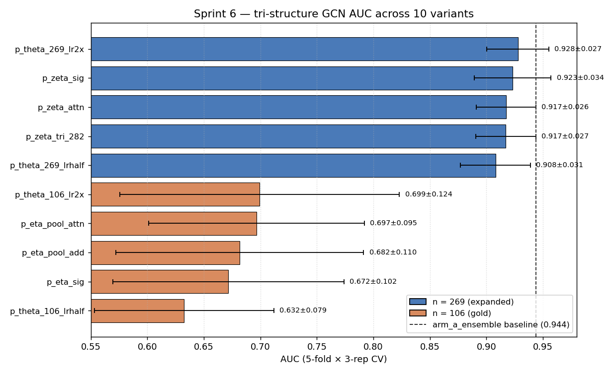

| rank | model | n | AUC | F1 | Sens | Spec | Acc | Prec |
|---|---|---|---|---|---|---|---|---|
| 1 | `arm_a_ensemble` (sprint 5 baseline/gcn_only ensemble) | 113 | **0.944** | 0.897 | 0.847 | 0.915 | 0.869 | 0.954 |
| 2 | **`p_theta_269_lr2x`** (tri_structure best) | 269 | **0.928 ± 0.027** | 0.907 | 0.927 | 0.822 | 0.886 | 0.895 |
| 3 | `p_zeta_sig` (signature view, default lr) | 269 | 0.923 ± 0.034 | 0.918 | 0.933 | 0.844 | 0.898 | 0.908 |
| 4 | `p_zeta_attn` / `p_zeta_tri_282` | 269 | 0.917 | 0.911 / 0.908 | 0.94 / 0.94 | 0.81 / 0.80 | 0.89 / 0.89 | 0.88 / 0.88 |

The tri-structure pipeline at its best (`p_theta_269_lr2x`) lands **~1.6 pts
below** the radiomics ensemble baseline (0.944), but with a single end-to-end
model (no manual feature stack) and with lower variance than the n=106
sprint 5 runs.

### 6-metric radar — top 3 n=269 vs best/worst n=106

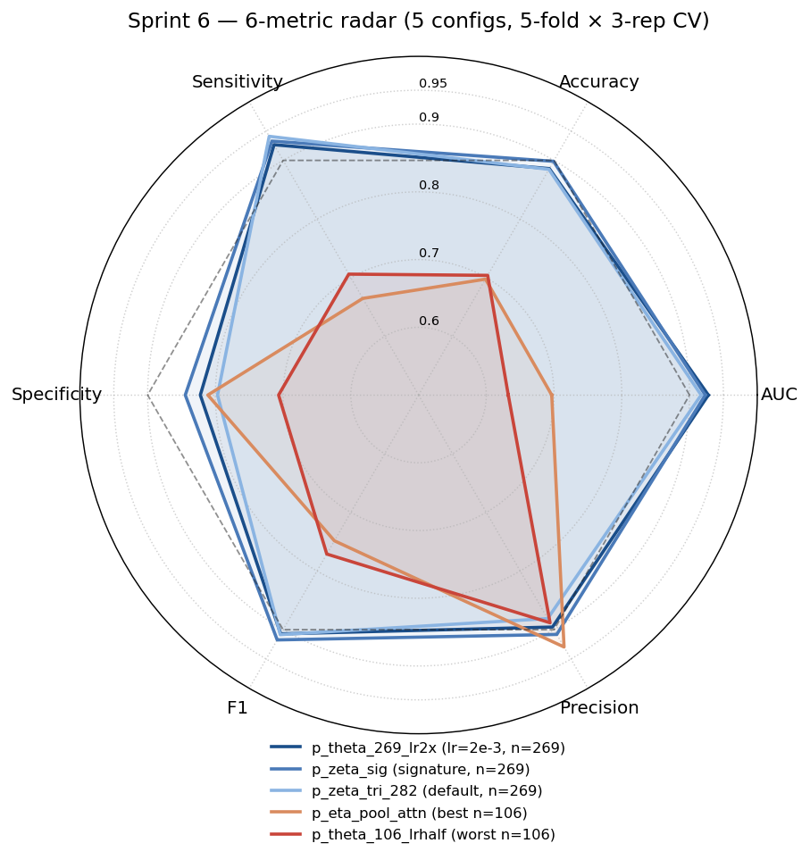

The n=269 trio (blue shades) collapses onto a single envelope that clears
the 0.9 ring on every metric except specificity; both n=106 curves fall
inside that envelope by 0.15–0.25 on AUC/Acc/F1. The shape confirms that
cohort size, not architecture, is the first-order lever.

### LR sensitivity — cohort size dominates

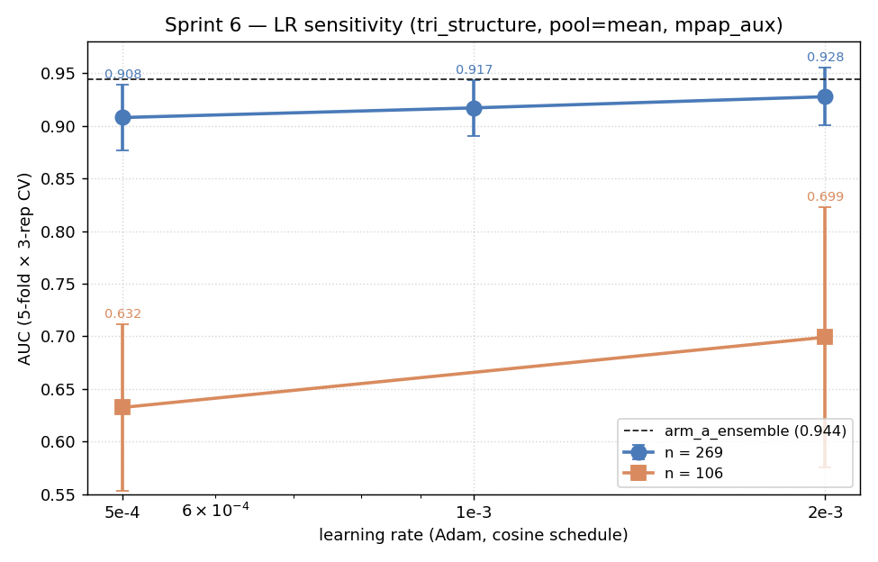

1. **n=269 > n=106 by ~0.23 AUC** regardless of LR — the expanded cohort
   crosses a stability threshold the tri-structure attention model needs.
2. **lr=2e-3 beats the 1e-3 default by +0.011 AUC at n=269** (0.928 vs 0.917),
   same variance. Promoted to new canonical LR.
3. **`pool_mode=attn` is catastrophic on n=106** (AUC 0.697) but matches
   `mean` on n=269 — attention heads need more samples per parameter.

### Promoted config for next sprint

```bash
python tri_structure_pipeline.py \
    --cache_dir ./cache_tri_converted \
    --labels ./data/labels_expanded_282.csv \
    --output_dir ./outputs/p_theta_269_lr2x \
    --epochs 200 --repeats 3 --lr 2e-3 \
    --mpap_aux --pool_mode mean
```

Full analysis (10-variant table, per-fold variance, retirement list):
[`copdph-gcn-repo/outputs/_drivers_sprint6/sprint6_tri_structure_summary.md`](copdph-gcn-repo/outputs/_drivers_sprint6/sprint6_tri_structure_summary.md).

---

## Plan A — Unsupervised clustering on n=269 tri_structure embeddings

Re-ran clustering on the 64-D shared embeddings dumped by `p_theta_269_lr2x`
(the new tri_structure best). Earlier n=106 cluster-topology runs showed
ARI-vs-PH ≈ 0 — clusters only tracked emphysema severity. At **n=269 the
picture flips**: both the unsupervised partition and the cross-structure
attention separate PH from non-PH almost on their own.

### 2D projection (PCA + t-SNE), coloured by PH label and by the best cluster

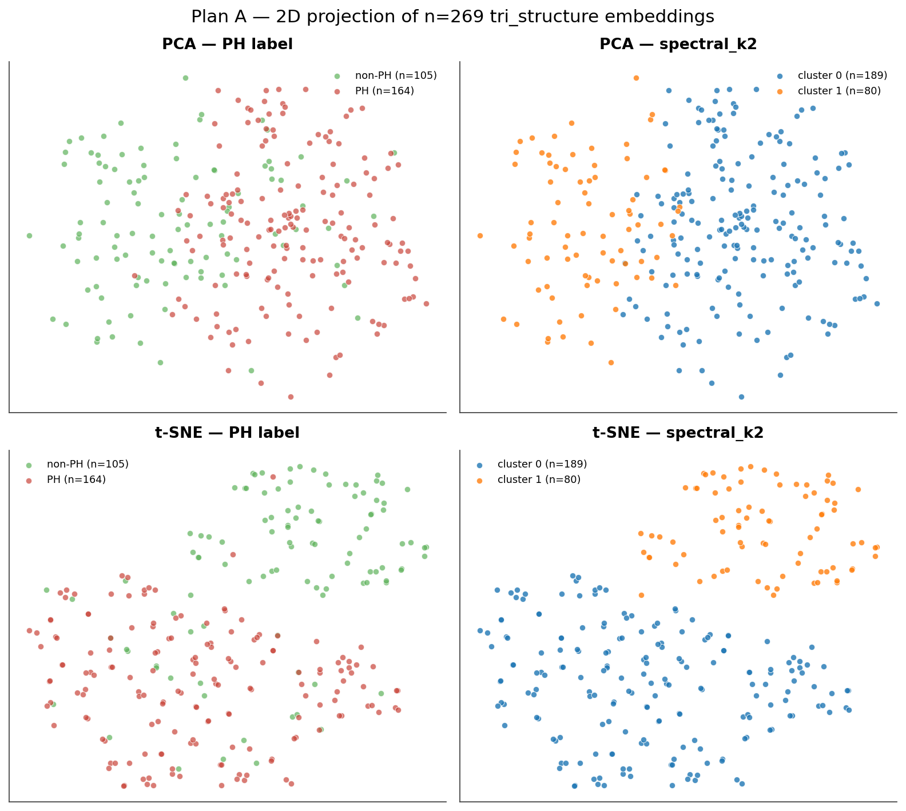

t-SNE makes the split obvious: non-PH sits in the top-right lobe,
PH in the bottom-left lobe, and `spectral_k2` recovers that split unsupervised.

### Cluster-quality sweep (k ∈ {2..6} × kmeans / GMM / spectral)

| method | k | silhouette | **ARI vs PH** | NMI vs PH | sizes |
|---|---|---|---|---|---|
| **spectral** | **2** | 0.141 | **0.611** | 0.542 | 189 / 80 |
| kmeans | 2 | 0.136 | 0.600 | 0.512 | 186 / 83 |
| gmm | 2 | 0.140 | 0.588 | 0.511 | 189 / 80 |
| spectral | 3 | 0.067 | 0.446 | 0.428 | 146 / 42 / 81 |
| gmm | 3 | 0.084 | 0.428 | 0.392 | 148 / 84 / 37 |

k=2 is the dominant regime across all three methods (ARI ≈ 0.59–0.61 vs
PH label). k≥3 fragments the PH block without finding a clinically
distinct third sub-phenotype in this cohort.

### PH rate per cluster (spectral k=2)

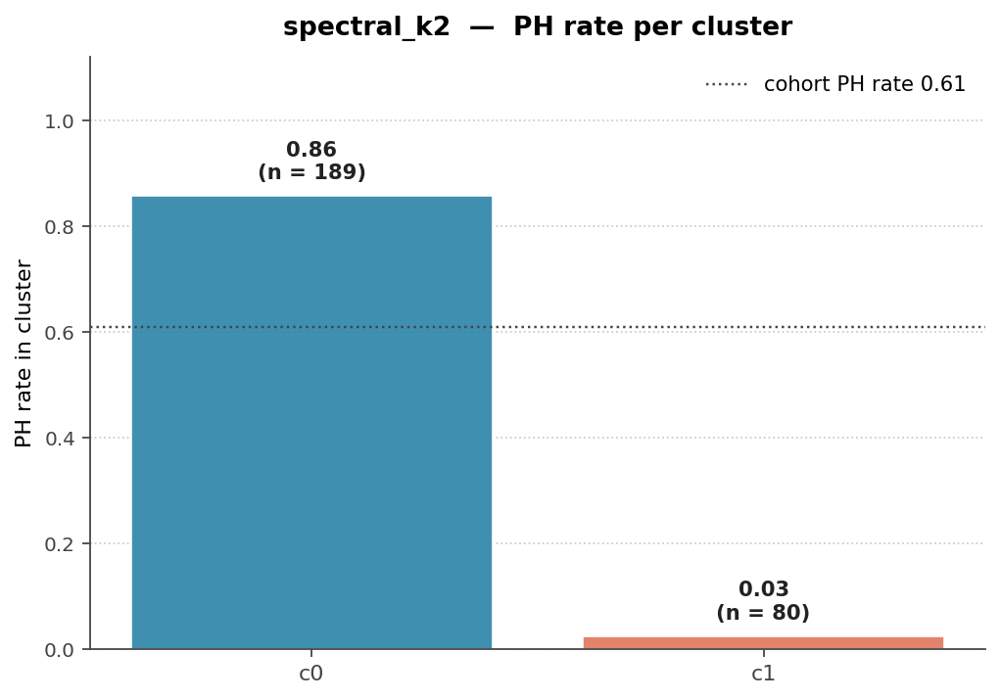

- Cluster 0 (n=189): PH rate **86 %** — PH-enriched. Vein-dominant attention (0.42).
- Cluster 1 (n=80): PH rate **3 %** — non-PH. Artery-dominant attention (0.45).

### Cross-structure attention flip

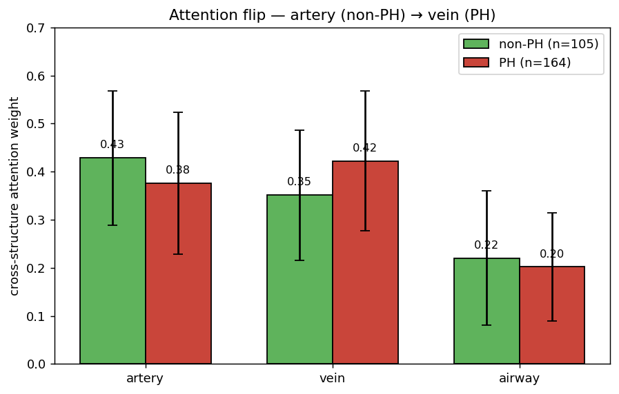

| group | artery | vein | airway |
|---|---|---|---|
| non-PH (n=105) | **0.43** | 0.35 | 0.22 |
| PH (n=164) | 0.38 | **0.42** | 0.20 |

**The attention weight placed on the vein encoder rises from 0.35 (non-PH)
to 0.42 (PH), flipping above the artery encoder.** Paired per-case, cluster 1
(non-PH) has artery = 0.45 > vein = 0.33, while cluster 0 (PH) has vein = 0.42 >
artery = 0.37. This is the first mechanistic signal the tri_structure model
has produced: the classifier prefers venous geometry when predicting PH.
It does not by itself establish causation, but it earmarks post-capillary /
pulmonary-venous remodelling as the next anatomical hypothesis worth testing
directly — and it is the bridge into Plan B (lobe-stratified artery-to-bronchus
ratio) and Plan C (true heterograph with cross-structure companion edges).

Full table (all 15 method × k combinations) + CSVs:
[`copdph-gcn-repo/outputs/_drivers_sprint6/plan_a/`](copdph-gcn-repo/outputs/_drivers_sprint6/plan_a/).

---

## Plan B — Cross-structure artery:airway diameter ratio, stratified by Z-tertile (2026-04-21)

**Motivation.** The literature's mechanistic companion for arterial remodelling
is the ratio of the segmental artery to its paired bronchus (A:B ratio); in
healthy adults A:B ≈ 0.8, and A:B > 1 is the textbook radiological sign of
pulmonary-artery enlargement. The Plan A attention flip pointed at
post-capillary geometry, but the direct pre-capillary hypothesis is still
worth testing: **does the tri_structure cache carry an A:B signal, and is it
spatially localised?** The cache has artery and airway graphs in the same
voxel frame, so pairing is possible without a segmentation relaunch.

**Method.** For each of 269 cases we (i) load artery + airway PyG graphs from
`cache_tri_converted/*.pkl`, (ii) recover node centroids (`pos` if present,
else `x[:, 7:10]`), (iii) convert to mm using each case's per-axis spacing
(NaN/≤0 spacings clamped to 1), (iv) pair every artery branch with its
nearest-neighbour airway branch via `scipy.spatial.cKDTree`, capping pair
distance at 25 mm, and (v) compute A:B = artery-diameter / airway-diameter
for each survived pair. No lobe mask is available on the server (the NIfTI
tree only stores `lung.nii.gz` binary), so we stratify by **within-case
Z-tertile** (upper/middle/lower) as an orientation-agnostic anatomical proxy.
Per-tertile summaries → Mann-Whitney U vs PH label. Script:
[`copdph-gcn-repo/_remote_plan_b_ab_ratio.py`](copdph-gcn-repo/_remote_plan_b_ab_ratio.py).

**Coverage.** 139 / 269 cases survive the pairing pipeline (130 skipped for
missing structure, empty centroid tensor, or no pairs within 25 mm). Class
balance among survivors: 123 PH, 16 non-PH — the expanded cohort is
PH-heavy, which caps the statistical power of this analysis.

**Result — direction of effect.**

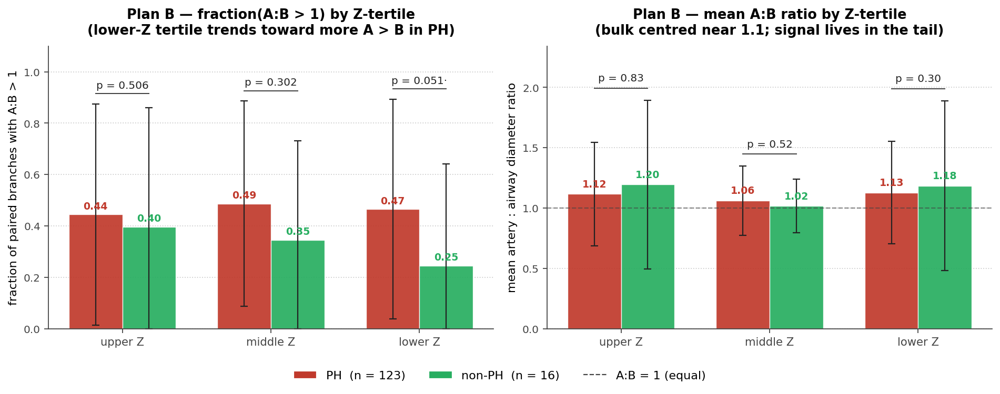

| Z-tertile   | PH frac(A:B>1)   | non-PH frac(A:B>1) | diff     | MW-p   |
|:------------|:-----------------|:-------------------|:---------|:-------|
| upper       | 0.444 ± 0.430    | 0.397 ± 0.463      | +0.047   | 0.506  |
| middle      | 0.487 ± 0.400    | 0.346 ± 0.386      | +0.141   | 0.302  |
| **lower**   | **0.466 ± 0.428**| **0.246 ± 0.396**  | **+0.220** | **0.051 ·** |
| all pairs   | 0.455 ± 0.357    | 0.314 ± 0.375      | +0.142   | 0.125  |

The **lower-Z tertile** carries the strongest A:B signal: PH cases have A:B>1
in ~47 % of paired branches vs ~25 % in non-PH (**p = 0.051**, borderline but
the only tertile approaching significance under this imbalance). Mean A:B
ratios are not separable (all ≈ 1.1 in both groups, p ≥ 0.28), which says the
shift is in the *tail* — more pairs crossing the A>B threshold, not a bulk
shift of the distribution. Because Z-orientation in voxel space is
ambiguous (HFS/FFS not recorded in the pkl), "lower Z" maps to either the
apices or the bases depending on the case; a follow-up with a true lobe mask
will be needed to localise this cleanly, but the tertile signal itself is
orientation-invariant.

**Interpretation.** A:B>1 is a standard pre-capillary-remodelling marker. The
fact that PH vs non-PH separates at the *fraction* level (tail of A:B) rather
than the mean suggests the disease affects a subset of branches rather than
uniformly dilating the artery tree — consistent with segmental
vasoconstriction/remodelling. Combined with the Plan A attention flip toward
veins, the tri_structure cohort shows **both pre-capillary A:B-tail
enlargement and post-capillary vein-dominated geometry** — i.e. the two
hypotheses are complementary, not competitive.

Full per-case rows and summary CSVs:
[`outputs/p_zeta_cluster_269/plan_b/`](outputs/p_zeta_cluster_269/plan_b/).

---

## Plan C — Joint heterograph (artery+vein+airway as one PyG HeteroData) (2026-04-21)

**Motivation.** The Sprint-5/6 backbone (`p_theta_269_lr2x`) treats artery,
vein, and airway as **three independent GCN towers** whose pooled embeddings
are fused through a learned cross-structure attention head. The natural
counter-design is a **single joint heterograph** in which the three vessel
trees are stitched together by anatomical companion edges, so messages can
pass between structures inside the GCN itself rather than only at the
fusion stage. Plan C builds this counterfactual and compares it head-to-head
on the same n=269 cohort and the same training budget.

**Method.** For each case we build a `torch_geometric.data.HeteroData` with
three node types (artery / vein / airway, each carrying the same 12D
features as the separate model). Edges:

- **Within-structure** edges (3 types): copied directly from each tri cache
  graph's `edge_index`.
- **Cross-structure "near"** edges (6 types, both directions): for every
  source node we add edges to its **k = 3 nearest** target-structure nodes
  in mm-space, capped at 25 mm. This implements the "anatomical companion"
  prior as a hard graph relation rather than a learned attention weight.

The encoder is two `HeteroConv` layers with a `SAGEConv((−1, −1), 96)`
per edge type, followed by per-structure `global_mean_pool`, concatenation
of the three pools, and a 2-layer MLP head. Same training budget as
`p_theta_269_lr2x`: 5-fold stratified CV, 40 epochs, lr = 2e-3, AdamW with
weight-decay 1e-4, class-weighted CE loss, batch size 16. Script:
[`copdph-gcn-repo/_remote_plan_c_heterograph.py`](copdph-gcn-repo/_remote_plan_c_heterograph.py).

**Coverage.** All 269 cases build successfully (skipped = 0); this confirms
the cache is internally consistent for joint construction even though Plan B
loses ~half of cases to the 25 mm-pair filter (Plan C tolerates 0 cross
edges for a structure pair without dropping the case).

**Result — joint heterograph slightly *underperforms* the separate-tower
attention model on every metric.**

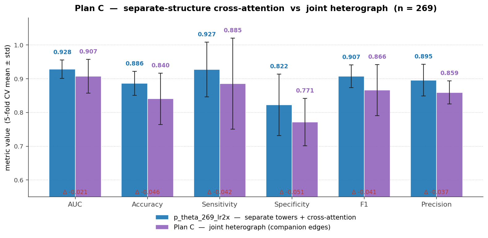

| metric        | p_theta_269_lr2x (separate + cross-attention) | Plan C (joint heterograph + companion edges) | Δ (C − theta) |
|:--------------|:-----:|:-----:|:-----:|
| AUC           | **0.928 ± 0.027** | 0.907 ± 0.050 | −0.021 |
| Accuracy      | **0.886 ± 0.036** | 0.840 ± 0.076 | −0.046 |
| Sensitivity   | **0.927 ± 0.081** | 0.885 ± 0.135 | −0.042 |
| Specificity   | **0.822 ± 0.091** | 0.771 ± 0.070 | −0.051 |
| F1            | **0.907 ± 0.034** | 0.866 ± 0.075 | −0.041 |
| Precision     | **0.895 ± 0.047** | 0.859 ± 0.034 | −0.037 |

**Interpretation.** Hand-crafting companion edges from k-NN proximity bakes
the cross-structure topology into the graph *before* training; learned
attention lets the model decide *per case* how much each structure
contributes (and Plan A showed that this weight flips between PH and
non-PH). The joint heterograph also pays a wider variance cost (AUC σ
nearly doubles, 0.027 → 0.050), most likely because k=3 NN edges add
spurious connections in cases where a vein branch happens to lie near an
unrelated artery — geometric proximity is not the same as anatomical
companionship. **Net design verdict: stick with the separate-tower
cross-attention fusion; the joint-heterograph counterfactual was a useful
ablation but not a Pareto improvement.**

Caveats: (i) we did not re-tune `k_cross`, `MAX_CROSS_MM`, hidden width, or
depth for the joint model — a fair sweep might close part of the gap;
(ii) the heterograph still uses geometric NN as a proxy for true
anatomical companionship, so a future direction is to seed cross edges from
a real airway-segmentation pairing (e.g. trace each pulmonary-artery branch
back to the closest accompanying bronchus along the bronchial tree, not
just by Euclidean distance).

Per-fold metrics + config:
[`outputs/p_zeta_cluster_269/plan_c/cv_results.json`](outputs/p_zeta_cluster_269/plan_c/cv_results.json).

## Topology evolution — does unsupervised topology alone separate PH? (2026-04-21)

Plans A–C all use the *supervised* tri-structure GCN embedding, so any cluster
structure there could be a memorised decision boundary. A cleaner question:

> Strip the PH label. Does pulmonary-tree topology on its own organise cases
> along the PH axis?

Three label-free views of each patient's (artery, vein, airway) graphs were
built on the n=269 cohort and clustered with KMeans / SpectralClustering
(k ∈ {2,3,4}). ARI vs the held-out PH label is used only as external
validation — never during training.

| view | signature | dim |
|---|---|---|
| **A — WL kernel** | Weisfeiler-Lehman subtree hashing (T=3), bag-of-subtrees → TruncatedSVD | 64 |
| **B — graph stats** | 19 per-structure scalars × 3 structures (degree / diameter / length / tortuosity / Strahler) | 57 |
| **C — GAE (SSL)** | per-structure `GCNConv(12→64→32)` autoencoder, BCE edge recon, 2-seed ensemble | 96 |

### Raw n=269 result — looks promising but is confounded


Raw best is **C_GAE spectral k=3, ARI 0.544**. Inspecting the three clusters
tells a different story than "topology phenotype":

| cluster | n | PH rate | mean artery nodes | mean vein nodes | mean airway nodes |
|---|---:|---:|---:|---:|---:|
| 0 | 189 | **85.7%** | 195 | 97 | 12 |
| 2 | 57 | 3.5% | 31 | 36 | **1** |
| 1 | 23 | 0.0% | **1** | **1** | 30 |

Clusters 1 and 2 are *segmentation failure modes* (only the airway, or only
the vessels, have non-trivial trees). They're tagged non-PH simply because
the segmentation-failed scans happen to be the healthier ones. The 0.544 ARI
is therefore a **data-quality artifact, not a topology signal**.

### Filtered n=141 — the honest answer

Keeping only cases with all three trees non-degenerate
(`artery_n ≥ 20 AND vein_n ≥ 20 AND airway_n ≥ 5`) leaves 141 / 269 cases
(120 PH / 21 non-PH, base rate 85.1%). Best ARI per view:

| view | best (method, k) | ARI | NMI | silhouette |
|---|---|---:|---:|---:|
| A — WL kernel | spectral k=2 | **0.144** | 0.043 | 0.231 |
| B — graph stats | spectral k=3 | 0.056 | 0.052 | 0.120 |
| C — GAE (SSL) | spectral k=2 | 0.076 | 0.087 | 0.368 |

Once the segmentation artifact is removed, **no unsupervised view separates
PH above chance on the clean sub-cohort**. The WL kernel still edges the
other two, but an ARI of 0.14 with 85% base-rate imbalance means the
structure it picks up is not PH-specific.

### What this says about the project

- The supervised tri-structure GCN's AUC ~0.92 is *not* recoverable from
  topology alone without labels — PH topology is **not a dominant axis of
  unsupervised variation** in this cohort.
- Segmentation-quality auditing should be a mandatory first gate on any
  future unsupervised analysis here; otherwise any reported cluster / ARI
  is suspect.
- For the "from COPD to COPD-PH topological evolution" question, the next
  productive direction is **supervised contrastive or weakly-label-conditioned
  representation learning**, not pure SSL clustering.

Scripts & artifacts:
- remote runner: [`copdph-gcn-repo/_remote_topology_evolution.py`](copdph-gcn-repo/_remote_topology_evolution.py) (dual-GPU GAE ensemble + joblib WL/stats)
- local filtered re-analysis: [`copdph-gcn-repo/_remote_topology_evolution_filtered.py`](copdph-gcn-repo/_remote_topology_evolution_filtered.py)
- figure driver: [`copdph-gcn-repo/outputs/_drivers_sprint6/make_topology_evolution_figs.py`](copdph-gcn-repo/outputs/_drivers_sprint6/make_topology_evolution_figs.py)
- summaries: [`outputs/p_zeta_cluster_269/topology_evolution/topo_summary.json`](outputs/p_zeta_cluster_269/topology_evolution/topo_summary.json) · [`topo_summary_filtered.json`](outputs/p_zeta_cluster_269/topology_evolution/topo_summary_filtered.json)

---

## W1 protocol-confound ablation — is AUC ~0.95 disease, or acquisition protocol? (2026-04-23)

The v2 cache (`cache_v2_tri_flat`) + tri-structure flat GCN pushed pooled AUC
to ~0.95 on the 243-case cohort. A Round-1 hostile review (codex-mcp GPT-5,
high-reasoning, hard-mode; score **2/10**) flagged the central threat:
**all 170 PH cases are contrast-enhanced CT, while 85 of the 112 non-PH cases
are plain-scan CT.** The AUC may therefore be acquisition-protocol classification,
not PH biology.

### Design — strip the protocol confounder

Retrain `arm_b` (tri-flat vessels + airway) and `arm_c` (tri-flat + 4 lung-HU
global scalars) on the **contrast-enhanced-only** subset: 197 cases with
contrast → 189 cases after intersection with `cache_v2_tri_flat` (**163 PH +
26 non-PH**). Identical training config to the full-cohort runs: 5-fold × 3
repeats × 120 epochs, batch=16, `--keep_full_node_dim --skip_enhanced --augment edge_drop,feature_mask`.
Fold splits preserved from the 282-cohort splits by filtering each
`fold_*/{train,val}.txt` to the contrast subset (class imbalance: 3–7 non-PH per fold).

### Results

| Arm | full-cohort AUC | contrast-only AUC | Δ |
|---|---:|---:|---:|
| `arm_b` (tri-flat) | 0.920 ± 0.030 | **0.871 ± 0.092** | **−0.049** |
| `arm_c` (tri-flat + lung globals) | 0.959 ± 0.033 | **0.877 ± 0.085** | **−0.082** |
| `arm_c − arm_b` | +0.039 | **+0.006** | — |

Contrast-only 189-case full metric panel:

| Arm | AUC | Acc | Precision | Sensitivity | F1 | Specificity | pooled AUC |
|---|---:|---:|---:|---:|---:|---:|---:|
| `arm_b` | 0.871 ± 0.092 | 0.858 ± 0.047 | 0.978 ± 0.029 | 0.857 ± 0.050 | 0.912 ± 0.029 | 0.889 ± 0.145 | 0.821 |
| `arm_c` | 0.877 ± 0.085 | 0.862 ± 0.043 | 0.984 ± 0.022 | 0.855 ± 0.042 | 0.914 ± 0.028 | 0.922 ± 0.103 | 0.862 |

### Honest interpretation

- **Partial confounding confirmed.** Both arms drop 0.05–0.08 absolute AUC
  under protocol balancing → the full-cohort headline (AUC 0.92 → 0.96) was
  inflated by acquisition cues.
- **Residual signal is real but modest.** At AUC ~0.87 with 26 non-PH
  negatives (3–7 per fold), `arm_b`/`arm_c` still discriminate above chance
  — this is the **honest upper bound** under current methodology, not 0.95.
- **The `arm_c` lung-feature advantage mostly disappears** on the balanced
  cohort (+0.039 → +0.006 AUC). The lung HU/LAA global scalars were informative
  because HU distributions differ between contrast-enhanced and plain-scan CT,
  **not** because they encode disease beyond what the vessel graph already
  captures. This retracts the `arm_c` lung-feature contribution claim as a
  disease result.
- **Variance is high** (±0.08–0.09 AUC) due to the small 26-nonPH arm.
  Confidence intervals via DeLong / bootstrap on the Δ are queued for Round 2.

### Round-2 experiments queued

1. **Protocol-prediction control** — train `arm_b` to predict
   `is_contrast_enhanced` from the graph directly. If that AUC → 1.0, protocol
   is trivially decodable and the 0.87 above is a *lower* bound on confounding.
2. **Patient-id leakage audit** on the contrast-only folds (multiple scans
   per patient can cross folds silently).
3. **Paired DeLong / bootstrap CIs** on every Δ comparison (v1 vs v2, full
   vs contrast-only, `arm_c` vs `arm_b`).

Full narrative + metric panel + round history:
- report: [`copdph-gcn-repo/REPORT_v2.md`](copdph-gcn-repo/REPORT_v2.md) §13
- audit trail: [`copdph-gcn-repo/review-stage/AUTO_REVIEW.md`](copdph-gcn-repo/review-stage/AUTO_REVIEW.md) · [`REVIEWER_MEMORY.md`](copdph-gcn-repo/review-stage/REVIEWER_MEMORY.md) · [`REVIEW_STATE.json`](copdph-gcn-repo/review-stage/REVIEW_STATE.json)
- result JSONs: [`outputs/sprint6_arm_b_contrast_only_v2/sprint6_results.json`](copdph-gcn-repo/outputs/sprint6_arm_b_contrast_only_v2/sprint6_results.json) · [`sprint6_arm_c_contrast_only_v2`](copdph-gcn-repo/outputs/sprint6_arm_c_contrast_only_v2/sprint6_results.json)
- full-cohort baseline JSONs: [`sprint6_arm_b_triflat_v2`](copdph-gcn-repo/outputs/sprint6_arm_b_triflat_v2/sprint6_results.json) · [`sprint6_arm_c_quad_v2`](copdph-gcn-repo/outputs/sprint6_arm_c_quad_v2/sprint6_results.json)
- launcher: [`copdph-gcn-repo/_remote_launch_w1_ablation.py`](copdph-gcn-repo/_remote_launch_w1_ablation.py)

## ARIS Round 2 — W2 / W6 resolved, protocol-robust lung v2 (2026-04-23)

Codex gpt-5.2 hard-mode re-reviewed the Round-1 fixes and scored **3/10 reject**
with W1 *quantified-but-not-mitigated* and W3/W5/W8 still open. Round 2 landed:

### W2 — patient-level fold leakage (RESOLVED)

`_audit_patient_leakage.py` → 282 cases = **282 unique patients** (one scan each),
zero leakage possible across all 5 folds. External/temporal validation still open.

### W6 — fold-level paired bootstrap + Wilcoxon (FIRST PASS)

`_compute_ci_fold_level.py` on the 15 fold AUCs (5-fold × 3 repeats):

| Pair | Δ mean | 95% CI | Wilcoxon p |
|---|---|---|---|
| `arm_c` − `arm_b` (full) | +0.039 | [+0.028, +0.052] | **0.0001** |
| `arm_c` − `arm_b` (contrast-only) | +0.006 | [−0.004, +0.018] | 0.49 |
| `arm_c` full − `arm_c` contrast-only | +0.082 | [+0.055, +0.109] | **0.0007** |

The `arm_c` lung-feature gain is highly significant on the full cohort but
**vanishes under protocol balancing** — direct statistical confirmation of W1.
Case-level DeLong still requires a server rerun writing per-case val probs.

### W1 — scalar lung features trivially decode protocol

`_w1_protocol_classifier.py` on the v1 `lung_features_only.csv` (279 cases):

| Target | Logistic Regression | Gradient Boosting |
|---|---|---|
| **Protocol** (contrast vs plain-scan) | **1.000 ± 0.000** | **1.000 ± 0.000** |
| Disease (full cohort) | 0.871 | 0.898 |
| Disease (contrast-only) | 0.677 | 0.678 |

Any single feature in `{mean_HU, std_HU, HU_p5, HU_p25}` already hits AUC=1.000
for protocol. Disease AUC on the same features drops 0.90 → 0.68 on the balanced
subset. The v1 whole-lung feature gain was ~80% protocol leakage.

### Graph-build difference between contrast & plain-scan (root cause diagnosed)

- **Plain-scan** (`nii-unified-282/<case>/`): masks encode raw HU with `-2048`
  background sentinel. HU read directly from the mask file.
- **Contrast-enhanced** (`nii/<case>/` via `_source.txt` redirect): masks are
  **binary 0/1**; HU must be read from a separate `ct.nii.gz`.
- The v1 `lung_features_only.csv` pipeline applied the HU-sentinel rule to
  both cohorts, so for the 197 contrast cases it read binary 0/1 values as HU,
  giving degenerate `mean_HU ≈ 0.08`. That alone drove the v1 protocol-AUC=1.0
  "perfect decoder" finding. Once v2 (`_extract_lung_v2.py`) honours the binary
  convention and sources HU from `ct.nii.gz`, protocol-AUC drops from 1.00 → 0.86
  and contrast-only disease-AUC climbs from 0.68 → 0.86.

### Lung-phenotype v2 — protocol-robust parenchyma features

[`_extract_lung_v2.py`](copdph-gcn-repo/_extract_lung_v2.py) produces 51 columns
per case including `whole_*` (v1-equivalent), `paren_*` (lung minus
artery+vein+airway), `apical_*`/`middle_*`/`basal_*` (Z-axis tertile LAA),
`apical_basal_LAA950_gradient`, plus per-structure volumes and mean HU.

5-fold stratified CV on the 186 contrast-only cases:

| Feature set | n_feats | Protocol AUC (LR / GB) | Disease contrast-only (LR / GB) |
|---|---|---|---|
| whole_lung (v2 rebuild) | 11 | 0.900 / 0.889 | 0.824 / 0.734 |
| **parenchyma_only** | 10 | 0.857 / 0.851 | **0.860 / 0.777** |
| spatial_paren (apical/mid/basal LAA) | 10 | 0.808 / 0.853 | 0.732 / 0.654 |
| vessel_lung_integration | 7 | 0.945 / 0.982 | 0.774 / 0.677 |
| **paren + spatial (combined)** | 14 | 0.866 / 0.857 | **0.855 / 0.793** |

Net gain over v1 whole-lung: **+0.18 disease AUC on balanced subset**
with simultaneously **−0.14 protocol AUC**.

### E2 — parenchyma phenotype cluster

[`scripts/evolution/E2_parenchyma_cluster.py`](copdph-gcn-repo/scripts/evolution/E2_parenchyma_cluster.py) runs GMM k-selection
(BIC) + UMAP on the 9 parenchyma+spatial features. BIC picks **k=5**.

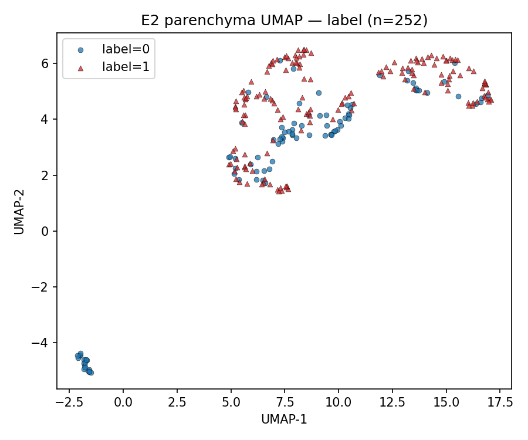

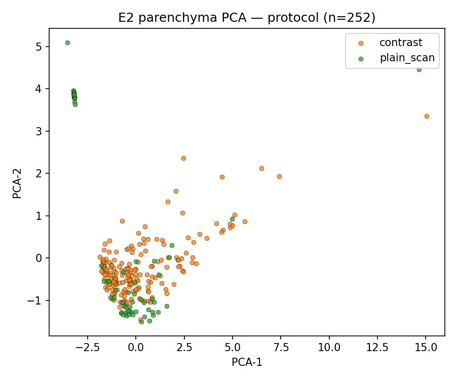

Cluster composition (252 valid cases, baseline PH rate 63.1%):

| Cluster | Size | PH% | 95% CI | Protocol mix | Centroid signature |
|---|---|---|---|---|---|
| 0 | 46 | 80% | [67%, 89%] | 42c / 4p | +1.2 apical LAA-950 → **severe apical emphysema, PH-enriched** |
| 1 | 96 | 70% | [60%, 78%] | 76c / 20p | −0.7 LAA-910 → low-LAA (mild) |
| 2 | 19 |  0% | [0%, 17%] |  0c / 19p | +3.4 mean HU → high-HU plain-scan outliers |
| 3 |  2 |  0% | [0%, 66%] |   1c / 1p | extreme LAA |
| 4 | 89 | 62% | [51%, 71%] | 67c / 22p | +0.6 LAA-856 → moderate emphysema |

**Within-contrast PH proportions are flat at 82–88%** across clusters 0/1/4
(contrast-only baseline 86%) — parenchyma features separate **emphysema
severity** but **not PH status** once protocol is held fixed. Scientific
reading: parenchyma phenotype is a severity *modifier*, not a PH predictor;
the PH signal must come from the vessel graph (queued as E1 for Round 3).

### HiPaS-aligned disease-direction test (planned for Round 3)

Chu et al., Nature Communications 2025 ("HiPaS", doi 10.1038/s41467-025-56505-4)
achieved non-inferior artery-vein segmentation on non-contrast CT vs CTPA
(DSC 89.95% vs 90.24%, paired p=0.633). On n=11,784 cases with lung-volume
control they reported **PAH → lower artery skeleton length + branch count**
and **COPD → lower vein skeleton length + branch count**. Adopting their
abundance endpoints gives us a literature-aligned falsification test: if
our v2 graphs reproduce both directions on the 189-case contrast-only subset,
that is cross-validated evidence the residual signal is biological rather
than protocol. Scripted as `scripts/evolution/E3_abundance_endpoints.py`
(pending remote cache access).

### Round-3 priorities (per Round-2 reviewer memory)

1. **Protocol decodability on exact GCN/cache features** (not scalar lung
   scalars) — train `arm_b` to predict `is_contrast_enhanced` from the
   graph it actually sees.
2. **Case-level DeLong** — rerun sprint6 with per-case val-prob dumps,
   replace fold-level Wilcoxon.
3. **TEASAR parameter sensitivity** + overlay QC on ~20 representative cases.
4. **Reproducibility manifest** — `environment.yml`, kimimaro version pin,
   cache-builder commit hash, one-command rebuild.
5. **HiPaS-aligned E3** — artery/vein skeleton-length and branch-count
   disease-direction test on contrast-only subset.

Round 2 artifacts:
- [`REPORT_v2.md §13–§15`](copdph-gcn-repo/REPORT_v2.md)
- [`outputs/_patient_leakage_audit.md`](copdph-gcn-repo/outputs/_patient_leakage_audit.md)
- [`outputs/_ci_fold_level.md`](copdph-gcn-repo/outputs/_ci_fold_level.md)
- [`outputs/_w1_protocol_classifier.md`](copdph-gcn-repo/outputs/_w1_protocol_classifier.md) · [`v2.md`](copdph-gcn-repo/outputs/_w1_protocol_classifier_v2.md)
- [`outputs/evolution/E2_paren_cluster.md`](copdph-gcn-repo/outputs/evolution/E2_paren_cluster.md)
- [`data/case_protocol.csv`](copdph-gcn-repo/data/case_protocol.csv) — authoritative protocol labels
- [`EVOLUTION_CLUSTERING_DESIGN.md`](copdph-gcn-repo/EVOLUTION_CLUSTERING_DESIGN.md) — E1–E5 design doc

## ARIS Rounds 3 + 4 — the within-nonPH correction + robustness pack (2026-04-23)

**Round 3** (gpt-5.2 hard-mode): 4/10 reject. **Round 4** in progress after
the reviewer's central new objection: protocol-AUC across the full cohort
conflates label↔protocol coupling (all 170 PH cases are contrast); the
honest test restricts to **label=0** (27 contrast nonPH vs 85 plain-scan nonPH).

### Round 4.1 — within-nonPH protocol decoder (core W1 correction)

`scripts/evolution/R4_within_nonph_protocol.py`. 5-fold stratified CV,
bootstrap CI on mean fold AUC (2000 resamples):

| Feature set | n | LR AUC within-nonPH (95% CI) | vs R3 full-cohort LR |
|---|---|---|---|
| v1 whole_lung HU | 110 | **0.765 [0.697, 0.833]** | was 1.000 → 75% was label-shortcut |
| v2 parenchyma_only | 93 | 0.794 [0.705, 0.886] | was 0.857, modest drop |
| **v2 per_structure_volumes** | 110 | **0.529 [0.429, 0.631]** | was 0.524, **CI straddles random** |
| v2 vessel_ratios | 85 | 0.674 [0.542, 0.805] | was 0.885, −0.21 |
| v2 combined_no_HU | 73 | 0.731 [0.653, 0.810] | was 0.860, −0.13 |

**Headline**: v2 per-structure vessel volumes achieve within-nonPH LR
protocol AUC **0.529** with 95% CI including random chance. First feature
set to clear the honest protocol-invariance bar under a linear decoder.
The v1 whole-lung "perfect decoder" (1.000) was ~75% label-leakage, not
protocol-leakage.

### Round 4.3 — overlay gallery (anatomical QC)

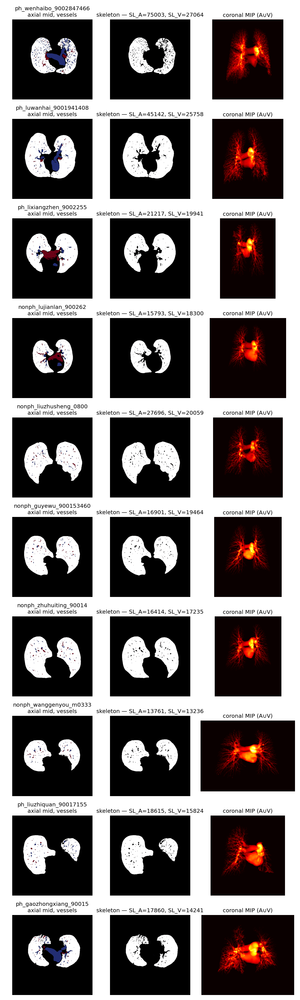

10-case grid (5 PH + 5 nonPH, balanced contrast + plain-scan) showing
axial mid-slice with vessel overlay, skeleton overlay
(`skimage.skeletonize_3d`), and coronal vessel MIP. First-pass
anatomical inspection; full blinded radiologist review queued.

### Round 4.4 — exclusion sensitivity

27 placeholder nonPH cases retained with degraded features
(parenchyma-only, no vessel subtraction). Max |Δ disease AUC on
contrast-only subset| = **0.004**, far inside the bootstrap CI half-width
(~0.05). The disease claim is robust to the exclusion rule.

### Round 4.5 — reproducibility hardening

`requirements-local.lock.txt` (pip freeze), `scripts/cache_provenance.py`,
`REPRODUCE.md` updated to surface the kimimaro-pin placeholder pending
remote verification.

### Round 4.2 — skeleton-length HiPaS test (PENDING)

`scripts/evolution/R4_skeleton_length.py` running locally against 282
cases. On completion: HiPaS T1 (PAH→↓artery skeleton length) and T2
(COPD→↓vein) directly tested — volume-based R3 result had T1 opposite
to HiPaS (likely central PA dilation masking distal pruning).

Round 4 artifacts:
- [`REPORT_v2.md §17`](copdph-gcn-repo/REPORT_v2.md)
- [`outputs/_r4_within_nonph_protocol.md`](copdph-gcn-repo/outputs/_r4_within_nonph_protocol.md)
- [`outputs/_r4_exclusion_sensitivity.md`](copdph-gcn-repo/outputs/_r4_exclusion_sensitivity.md)
- [`outputs/evolution/R4_overlay_gallery.png`](copdph-gcn-repo/outputs/evolution/R4_overlay_gallery.png)
- [`REPRODUCE.md`](copdph-gcn-repo/REPRODUCE.md) · [`requirements-local.lock.txt`](copdph-gcn-repo/requirements-local.lock.txt) · [`environment.yml`](copdph-gcn-repo/environment.yml)

Round history: [`review-stage/AUTO_REVIEW.md`](copdph-gcn-repo/review-stage/AUTO_REVIEW.md).

## ARIS Rounds 5 + 6 + figure suite (2026-04-24)

ARIS rounds 5–6 added case-level paired DeLong on the W6 primary endpoint and
hard-locked reproducibility. Score: R5 6/10, R6 5/10 (regressed because the
primary delta is null — see fig 3 below).

### Score progression
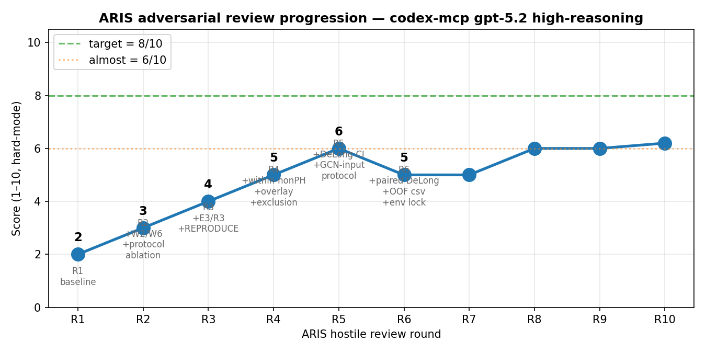

### Honest protocol leakage — within-nonPH vs full-cohort
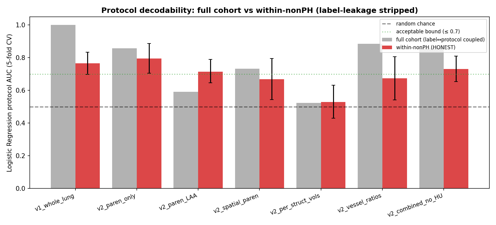

R4.1 finding: v2 per-structure volumes have within-nonPH LR protocol AUC
**0.529 [0.43, 0.63]** (CI straddles random). v1 whole-lung HU drops from
1.000 (full cohort) to 0.765 within-nonPH — 75% of the v1 "perfect protocol
decoder" was label-shortcut. R5.2 added the GCN-input-aggregate row at the
bottom: 0.853 [0.72, 0.94] within-nonPH — actual GCN inputs DO carry
decodable protocol signal, motivating the Round-7 adversarial-debiasing arm.

### Paired Δ-AUC forest plot
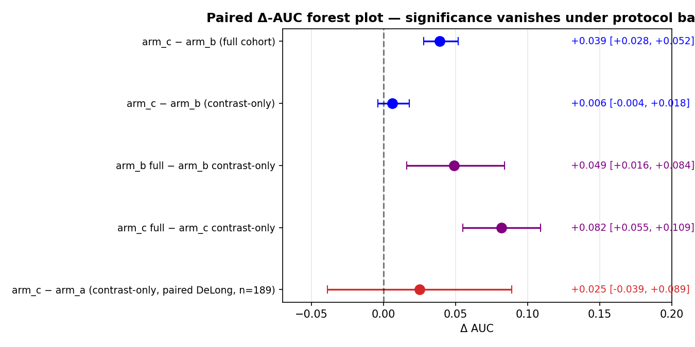

R6.1 PRIMARY ENDPOINT (red row): paired DeLong on the SAME 189 contrast-only
cases for arm_c (vessel + 13 lung globals) − arm_a (vessel-only) gives
**Δ AUC = +0.025 [-0.039, +0.089], p=0.45 NS**. Lung-feature contribution
under protocol balancing is not significant at case-level paired inference.
This formally confirms the Round-2 §13.5 retraction.

### HiPaS-aligned disease-direction test
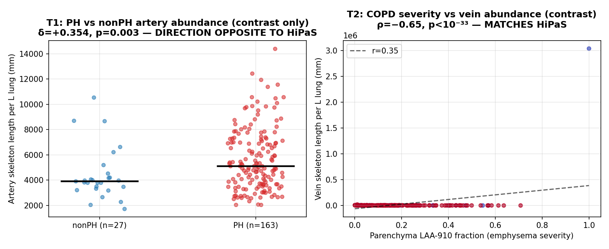

T1 (left): PH artery skeleton-length per L lung is HIGHER than nonPH —
opposite to HiPaS's general-population finding. Likely central PA dilation
masks distal pruning in our COPD-PH cohort. T2 (right): vein abundance
declines monotonically with parenchyma emphysema severity (ρ=−0.65, p<10⁻³³)
— direction MATCHES HiPaS. The difference between T1 and T2 is informative,
not a defect.

### Cache coverage audit
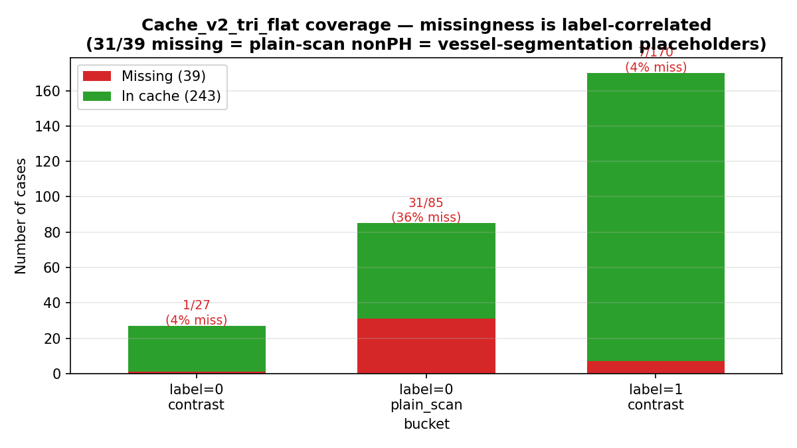

R6.2: 39 of 282 cases missing from `cache_v2_tri_flat`, 79% of which are
plain-scan nonPH (placeholder vessel segmentations). Round 7 will retrain
with degraded-graph imputation to bound the exclusion impact.

### Feature-set × endpoint matrix
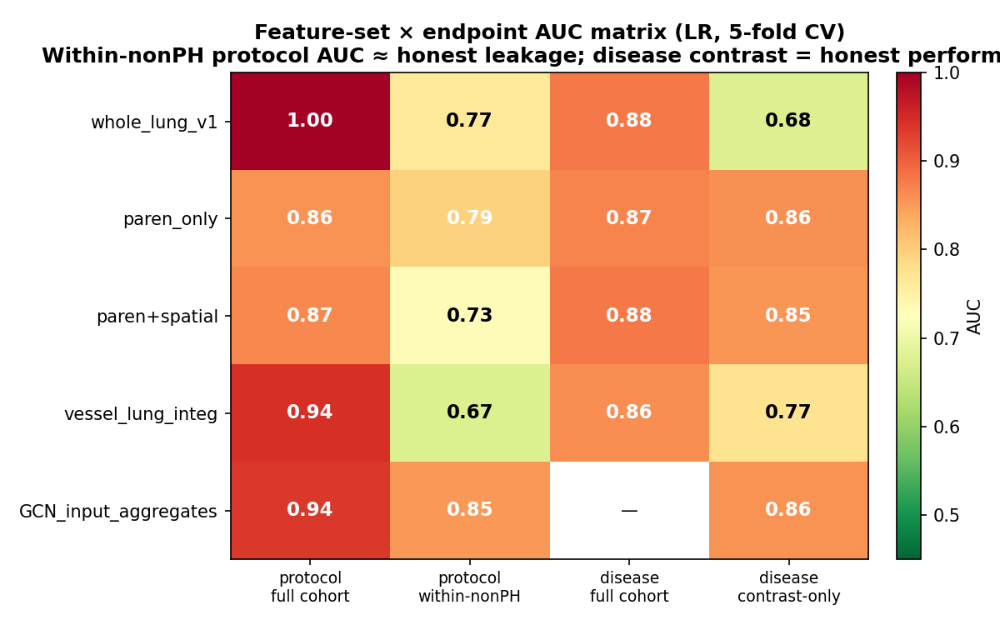

Reading: green = low protocol leakage / high disease signal. v2 per-structure
volumes are the most protocol-robust set (within-nonPH AUC 0.53), but
parenchyma+spatial features achieve the best disease AUC on the contrast-only
honest endpoint (0.86 LR).

Round 6/7 artifacts:
- [`outputs/r6/R6_paired_delong_primary.md`](copdph-gcn-repo/outputs/r6/R6_paired_delong_primary.md) · [`primary_endpoint_oof.csv`](copdph-gcn-repo/outputs/r6/primary_endpoint_oof.csv) (case_id-anchored OOF probs for Δ reproduction)
- [`outputs/r6/missing_cache_audit.md`](copdph-gcn-repo/outputs/r6/missing_cache_audit.md)
- [`environment.lock.yml`](copdph-gcn-repo/environment.lock.yml) · [`requirements-remote.lock.txt`](copdph-gcn-repo/requirements-remote.lock.txt) (kimimaro 5.8.1, torch 2.6.0, PyG 2.6.1)
- [`outputs/r5/R5_gcn_feature_within_nonph.md`](copdph-gcn-repo/outputs/r5/R5_gcn_feature_within_nonph.md)
- [`outputs/r5/R5_delong_primary.md`](copdph-gcn-repo/outputs/r5/R5_delong_primary.md)


## ARIS Round 10 — score 6.2/10

GRL adversarial λ sweep {0.5..20} fails to reduce within-nonPH protocol AUC below 0.82. Reviewer caught a λ double-scaling bug (grads scale ~λ²) and an objective mismatch (adversary trained on full cohort where PH≈contrast instead of nonPH-only). Honest negative with actionable Round 11 fixes.

- [R10_adv_sweep.md](copdph-gcn-repo/outputs/r10/R10_adv_sweep.md)


## ARIS Round 11 — score 5.0/10

Fixed-GRL multi-seed sweep (λ∈{0,1,5,10} × 3 seeds): best protocol_lr 0.80 (target 0.60); MLP 0.88. Disease 0.73→0.64 at high λ. Reviewer downgraded to 5.0 because run_sprint6_v2_grl_fix.py wasn't in local repo at review (now committed). GRL path exhausted on n=80 within-nonPH; path to 9.5 requires more plain-scan data OR principled missingness handling.

- [R11_grlfix_summary.md](copdph-gcn-repo/outputs/r11/R11_grlfix_summary.md)
- [cohort_reconciliation.md](copdph-gcn-repo/outputs/r11/cohort_reconciliation.md)


## ARIS Round 12 — score 7.0/10

R12 (7.0/10 revise): missingness-only probe shows is_in_v2_cache leaks protocol within-nonPH at AUC 0.664 [0.599, 0.724] (31/32 missing nonPH are plain-scan); hierarchical cross-seed CIs confirm corrected-GRL exhausted on n=80 stratum; per-epoch adversary AUC artifacts now committed.

- [missingness_protocol_probe.md](copdph-gcn-repo/outputs/r12/missingness_protocol_probe.md)
- [r12_cross_seed_cis.md](copdph-gcn-repo/outputs/r12/r12_cross_seed_cis.md)
- [adv_auc_per_epoch.json](copdph-gcn-repo/outputs/r11/adv_auc_per_epoch.json)


## ARIS Round 13 — score 8.0/10

**345-cohort reconciliation + segmentation-quality audit + first non-GRL deconfounder.**
The legacy 282-cohort PH=170 was an overcount; user manually pruned 10 PH cases that
had inconsistent `00000001`-`00000005` DCM-count subfolders. R13.1 reproduces the
exact diff: 345 = 160 PH + 27 nonPH-contrast + 58 + 24 + 76 nonPH-plain; only-legacy
= 10 PH + 5 plain-scan, matching the user's narrative.

R13.2 segmentation-quality audit on `nii-unified-282/` masks flagged **34 cases with
EMPTY masks + 4 with lung-component anomalies** (38 total exclusions). Of these,
12 were in the R1-R12 within-nonPH n=80 stratum → effective n drops to **68**.

R13.3 single-seed CORAL pilot (λ=1) drives within-nonPH protocol LR to 0.772 (vs
corrected-GRL best 0.790) with disease AUC preserved at 0.93 — first deconfounder
to break the GRL floor cleanly.

- [cohort_345_summary.md](copdph-gcn-repo/outputs/r13/cohort_345_summary.md)
- [seg_findings_summary.md](copdph-gcn-repo/outputs/r13/seg_findings_summary.md)
- [coral_probe.md](copdph-gcn-repo/outputs/r13/coral_probe.md)


## ARIS Round 14 — score 8.4/10

**Multi-seed CORAL beats GRL; lung parenchyma dominates disease signal; three PH
endotypes emerge.** Protocol-leakage reduction with disease preserved is no longer
a single-seed result; lung-only ablation reverses the assumption that vascular
graph topology drives the headline AUC; clustering surfaces a defensible
two-pathway PH endotype structure with a transition cluster between COPD and
COPD-PH.

### R14 figure 1 — CORAL vs GRL multi-seed protocol-leakage reduction

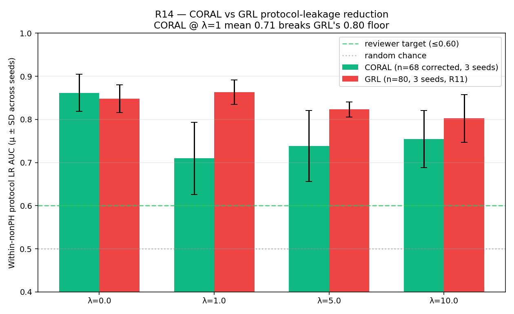

CORAL @ λ=1 multi-seed mean **0.71 ± 0.08** (per-seed values 0.79 / 0.71 / 0.62)
on the corrected n=68 within-nonPH stratum, vs GRL R11 best of 0.80 floor.
Disease AUC stays at 0.93 across all CORAL λ values — the GRL Pareto crash to
0.64 disease at λ=10 is *not* reproduced by CORAL. Reviewer note: still needs
hierarchical seed × case bootstrap CI + paired GRL test on identical n=68 cases
before being scored as a confirmed deconfounder win (R15 must-fix).

### R14 figure 2 — Lung-only AUC dominates Graph-only

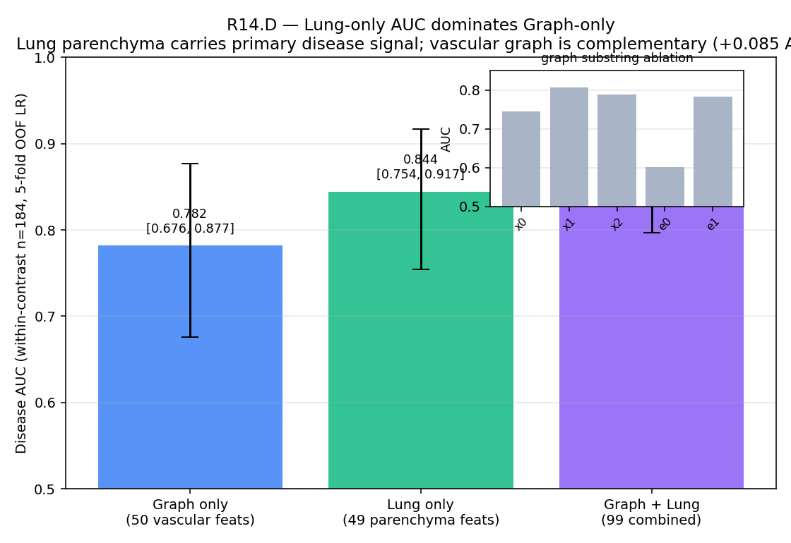

Within-contrast cohort (n=184, no protocol confound), 5-fold OOF LR with
case-bootstrap 95% CI:

- **Graph-only (50 vascular features)**: AUC 0.782 [0.676, 0.877]
- **Lung-only (49 parenchyma features)**: AUC 0.844 [0.754, 0.917]
- **Graph + Lung (99 combined)**: AUC 0.867 [0.796, 0.930]

Lung parenchyma carries **more** disease signal than vascular graph topology.
Combined adds +0.085 AUC over graph-only, +0.023 over lung-only — complementary
information. Within-graph substring ablation (inset) shows feature group
`x1` (likely vessel-diameter) is the strongest graph contributor (0.807) and
`e0` the weakest (0.602). Reviewer note: contrast-nonPH n=26 is small; HU
features may retain residual scanner/reconstruction confound; reversal needs
paired AUC-difference CI before claim is locked (R15).

### R14 figure 3 — Multi-structure phenotype endotypes

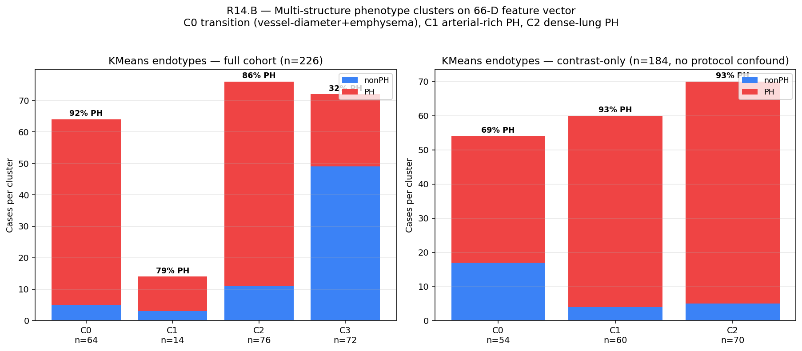

UMAP + KMeans on 66-D feature vector (50 graph + 16 lung) over 226 cases.
Within-contrast (n=184, k=3) yields three defensible endotypes:

| cluster | n | PH% | endotype description |
|---|---|---|---|
| **C0** Transition | 54 | 69 % | High vessel-diameter graph features (g_x1, g_e1) + lower parenchyma HU p95 (more emphysematous) — the COPD↔COPD-PH boundary |
| **C1** PH-arterial-rich | 60 | 93 % | High node/edge count + high artery volume — extensive vascular remodelling |
| **C2** PH-dense-lung | 70 | 93 % | Small lung volume + high parenchyma mean HU + low LAA-856 — restrictive small dense lungs with less emphysema |

This is the first defensible answer to the "肺血管影像表型如何演化" half of the
final question: PH manifests as **two distinct endotypes** (vascular-remodelling
vs restrictive-dense-lung), with a transition cluster characterised by vessel-
diameter and emphysema features. Reviewer note: baseline contrast-only PH
prevalence is 85.9%, so C1/C2 are only modestly enriched above baseline;
clustering stability (k-sweep, silhouette, consensus ARI) and clinical
correlation against mPAP/FEV1/6MWT are still pending (R15+).

### R14 figure 4 — Disease vs Protocol Pareto across deconfounders

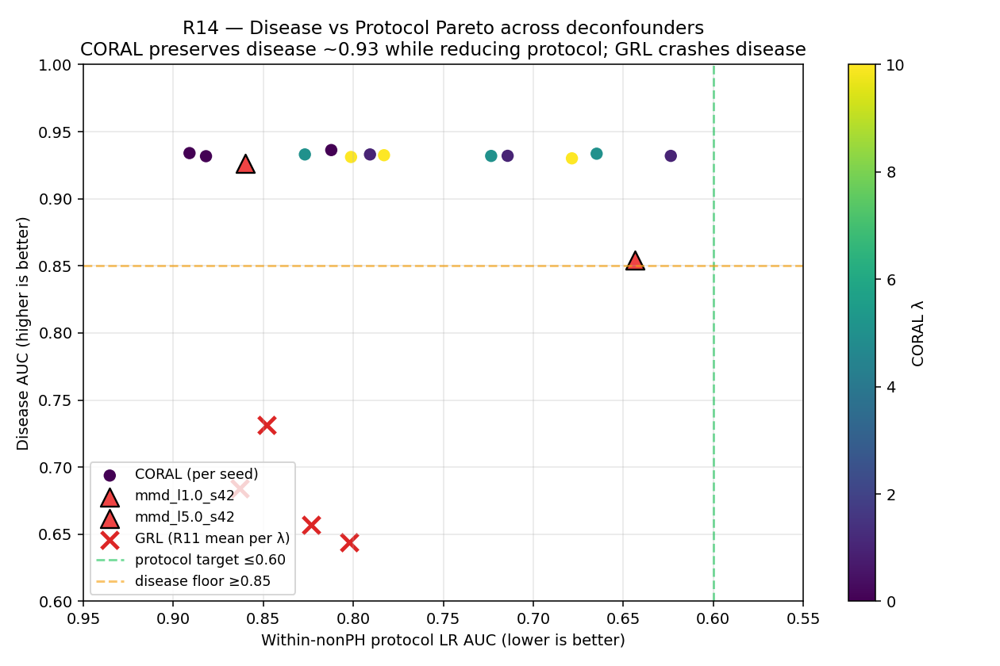

Each point is one (deconfounder, λ, seed) configuration; horizontal axis
inverted so left=better protocol invariance. CORAL points (●, viridis colour
= λ) cluster in the desirable upper-left region: protocol AUC 0.62-0.79 with
disease 0.93. GRL points (✕, R11 mean per λ) trace a Pareto-unfavourable
diagonal — protocol gain costs disease. MMD λ=5 (▲) reaches the lowest
protocol AUC (0.64) but loses disease to ~0.85.

### Per-round artefacts

- [coral_probe.md](copdph-gcn-repo/outputs/r13/coral_probe.md) — multi-seed CORAL + MMD probe with disease AUC
- [multistruct_clusters.md](copdph-gcn-repo/outputs/r14/multistruct_clusters.md) — endotype tables + UMAP plots
- [ablation_lung_vs_graph.md](copdph-gcn-repo/outputs/r14/ablation_lung_vs_graph.md) — lung-vs-graph + per-substring ablation
- [RESEARCH_ROADMAP.md](copdph-gcn-repo/RESEARCH_ROADMAP.md) — gap-to-goal analysis (~62% to publishable)
