# COPD-PH Pulmonary Vessel GCN

> **Authoritative manuscript scope (R23): see `CLAIMS_TABLE_R23.md`.**
> That table is the source of truth for which claims are CITED, DEMOTED,
> or RETIRED in the manuscript. R22 explicitly retired cross-protocol
> enlarged-cohort PH-vs-nonPH AUC claims, single-pipeline ρ magnitude
> claims, label-free DDPM PH-detector framing, and GCN-embedding-level
> enlarged-cohort deconfounding (out of scope for this paper).
>
> **All Sprint 2/3/5/6 classifier AUC tables below are HISTORICAL
> ENGINEERING ARTIFACTS, NOT manuscript claims.** They document the
> engineering progression of the project before peer-review-equivalent
> hostile review forced scope reduction. Do not cite these AUC numbers
> as paper findings without consulting `CLAIMS_TABLE_R23.md` first.

Graph-neural-network classification of pulmonary hypertension (PH) from chest-CT
pulmonary vessel trees, fused with commercial radiomics features. The repo
covers the full Sprint 2 pipeline: vessel-tree graph construction, hybrid GCN
training, 5-fold cross-validation, and interpretability visualizations.

## Task

Binary classification — **COPD-PH vs COPD-nonPH** — from:
- **Graph modality**: per-patient pulmonary vessel tree. Nodes = vessel
  segments, edges = bifurcation connectivity. 12D baseline / 16D enhanced node
  features (geometry + CT density + commercial fractal dim / A-V density).
- **Radiomics modality**: 45D commercial CT radiomics vector per patient.

Three training modes are compared:

| mode | inputs |
|---|---|
| `radiomics_only` | 45D radiomics → MLP head |
| `gcn_only` | vessel graph → GCN + global pool |
| `hybrid` | GCN embedding ⊕ radiomics → MLP head |

## Sprint 3 — P0 improvements (focal loss + Youden calibration + globals pruning)

Sprint 2 v2 hybrid had Specificity stuck at 0.71 (many false positives on the
majority-class non-PH cases). Three P0 changes were applied in
`run_sprint3.py`:

1. **Youden's J threshold calibration** per fold (primary metrics now use the
   val-optimal threshold; the old 0.5-argmax metrics are retained in
   `*_argmax` keys for comparison).
2. **Focal loss** (γ=2, class-balanced α via Cui 2019) to replace the old
   weighted cross-entropy.
3. **Graph-level globals pruning** (`--globals_keep local4`): keep only the 4
   locality-meaningful commercial scalars
   (`bv5_ratio, total_bv5, total_branch_count, vessel_tortuosity`) and drop the
   8 whole-lung scalars that overlap with the 45D radiomics branch.

Three arms were run, each a full 5-fold × 3-mode × 2-feature-set sweep:

| arm | loss | `globals_keep` | purpose |
|---|---|---|---|
| `focal_local4` | focal | 4 local globals | primary P0 combination |
| `focal_all` | focal | all 12 | ablate globals pruning |
| `wce_local4` | weighted_ce | 4 local globals | ablate focal loss |

### Headline result (5-fold CV, enhanced / hybrid mode)

| run | AUC | ACC | Prec | Sens | F1 | **Spec** |
|---|---|---|---|---|---|---|
| sprint2_v2 baseline/hybrid | 0.898 | 0.804 | 0.905 | 0.836 | 0.857 | 0.710 |
| sprint2_v2 enhanced/hybrid | 0.852 | 0.797 | 0.961 | 0.769 | 0.841 | 0.870 |
| **sp3 focal_local4** enh/hyb | **0.912** | 0.889 | 0.983 | 0.870 | 0.920 | **0.950** |
| sp3 focal_all enh/hyb | 0.890 | 0.901 | 0.987 | 0.883 | 0.924 | 0.950 |
| sp3 wce_local4 enh/hyb | 0.895 | **0.919** | 0.974 | **0.920** | **0.944** | 0.910 |

**Specificity lifted from 0.71 → 0.95 (+24 points)** while AUC also improved.
Full 24-row comparison table lives in `outputs/sprint3_vs_sprint2.xlsx`.

### Ablation read

- **Youden calibration** is the dominant factor — all three arms share it and
  all three beat sprint2_v2 handily.
- **`local4 > all`** (focal AUC .912 vs .890) — confirms the 8 whole-lung
  scalars were redundant with the 45-dim radiomics vector and were hurting
  hybrid.
- **focal vs weighted_ce** (both `local4`): focal wins AUC .912 vs .895; wce
  wins F1 .944 vs .920. Both strongly beat the old uncalibrated setup.

### Sprint 3 visualizations

Per-arm radar (3-mode × baseline-vs-enhanced), with a 0.9 gridline ring so it's
easy to check which metrics cleared 0.9:


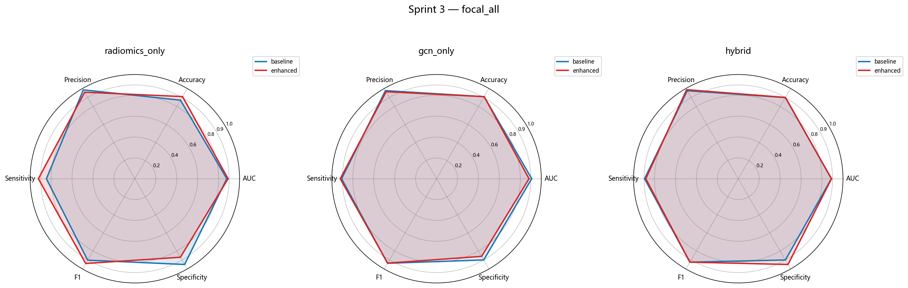
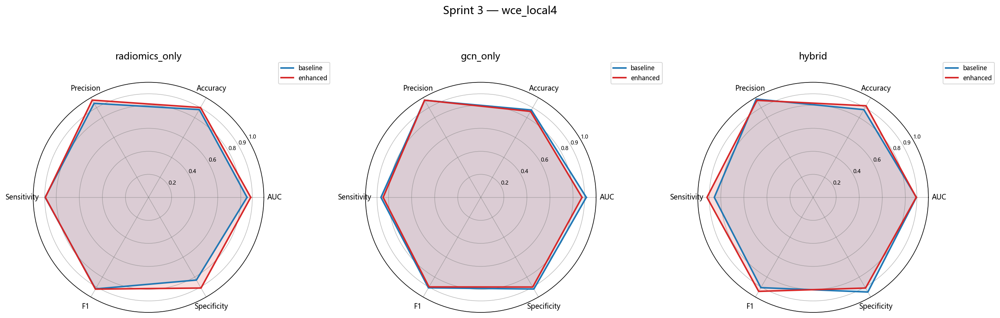

Cross-arm comparison on the enhanced feature set:

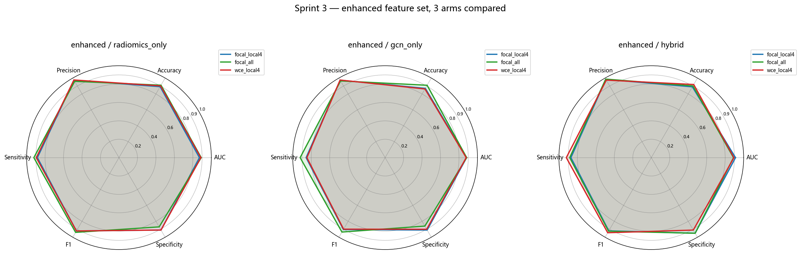

Bar chart vs sprint2 (enhanced / hybrid only, all 6 metrics):

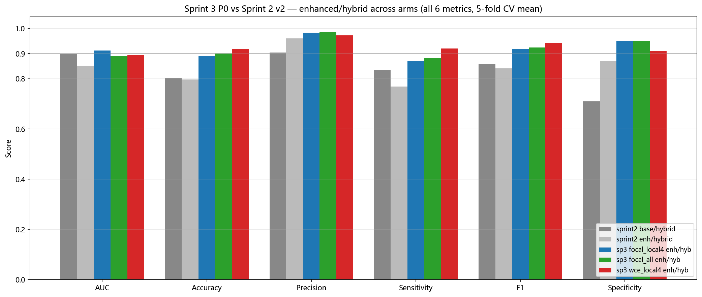

### Recommended configuration

`focal_local4 / enhanced / hybrid` — AUC 0.912, Specificity 0.950, Precision
0.983. To reproduce:

```bash
python run_sprint3.py \
    --cache_dir ./cache --radiomics ./data/copd_ph_radiomics.csv \
    --labels <labels.csv> --splits <splits_dir> \
    --output_dir ./outputs/sprint3_focal_local4 \
    --epochs 300 --batch_size 8 --lr 1e-3 \
    --loss focal --globals_keep local4
```

---

## Sprint 2 baseline — results (5-fold CV, n = 96 matched patients)

See `outputs/sprint2_metrics.xlsx` and `outputs/sprint2_radar*.png`.

| feat_set | mode | AUC | ACC | F1 | Spec | Sens | Prec |
|---|---|---|---|---|---|---|---|
| baseline (12D) | radiomics_only | 0.854 | 0.831 | 0.887 | 0.700 | 0.868 | 0.910 |
| baseline (12D) | gcn_only | **0.926** | 0.784 | 0.833 | 0.620 | 0.823 | 0.892 |
| baseline (12D) | hybrid | 0.900 | 0.726 | 0.806 | 0.540 | 0.798 | 0.855 |
| enhanced (16D) | radiomics_only | 0.881 | 0.741 | 0.781 | 0.590 | 0.791 | 0.879 |
| enhanced (16D) | gcn_only | 0.854 | 0.776 | 0.834 | 0.750 | 0.777 | 0.921 |
| enhanced (16D) | hybrid | 0.887 | **0.821** | 0.865 | **0.820** | 0.811 | **0.950** |

The 4 enhancement features (fractal dim, artery/vein density, volume-calibrated
diameter) substantially lift specificity of the hybrid model (0.54 → 0.82).

## Visualizations

### 6-metric radar (5-fold CV, 0.9 reference ring)

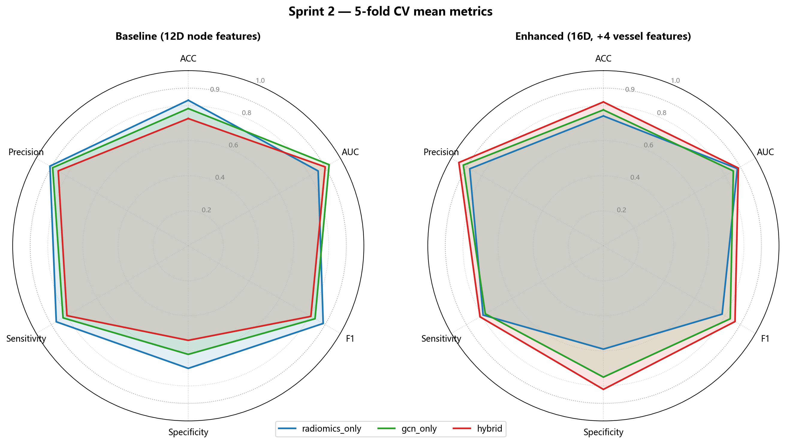

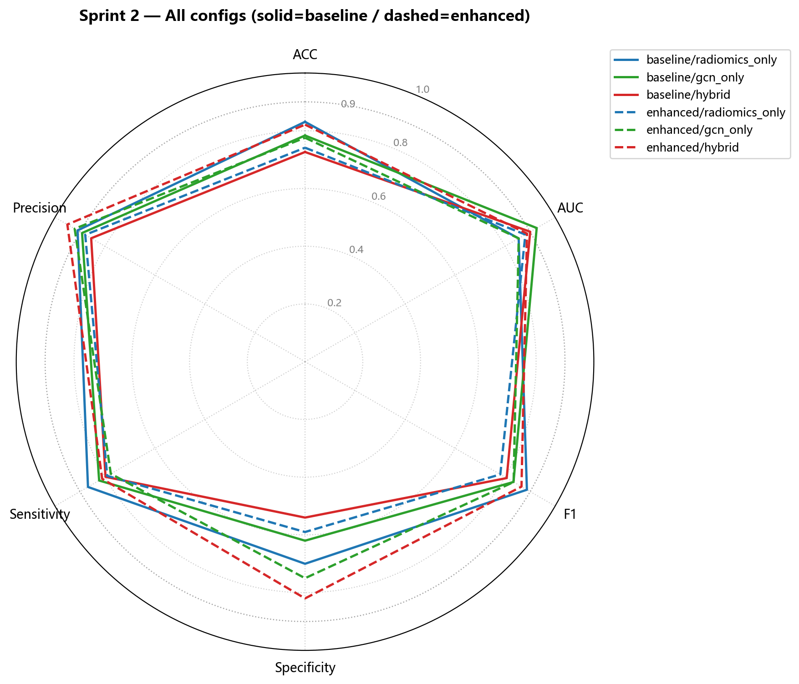

### Group statistics — PH vs non-PH

Distributions of the 4 commercial vessel features (boxplots + Mann-Whitney p).

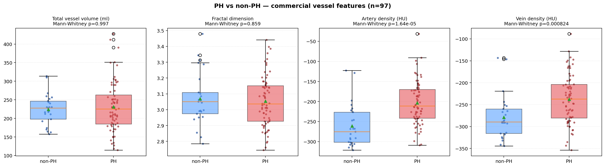

### 3D pulmonary vessel graphs

One PH + one non-PH case, nodes coloured by branching degree.


### Per-node saliency (enhanced-hybrid GCN, fold 1)

Same two cases, nodes coloured by input-gradient saliency `|∂ p(PH) / ∂ x_node|`.


### Per-node saliency across all 5 folds

For each fold k, we re-train the enhanced-hybrid GCN on its training set and
compute saliency on the first PH + non-PH case from its validation set.

| | val AUC |
|---|---|
| Fold 1 | 0.96 |
| Fold 2 | 1.00 |
| Fold 3 | 1.00 |
| Fold 4 | 0.78 |
| Fold 5 | 0.78 |


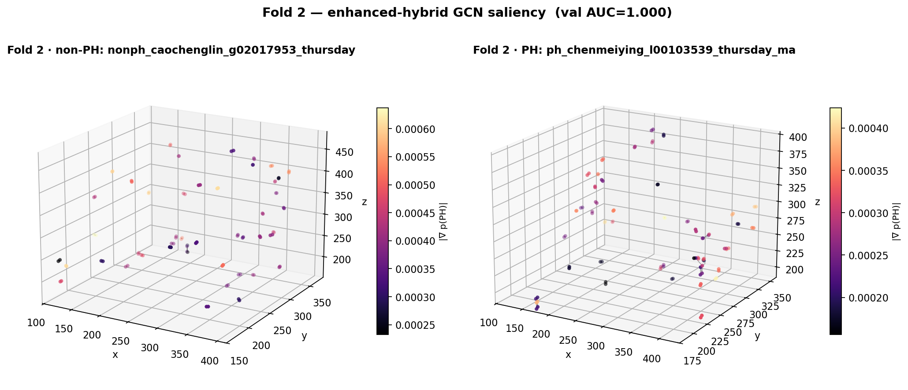
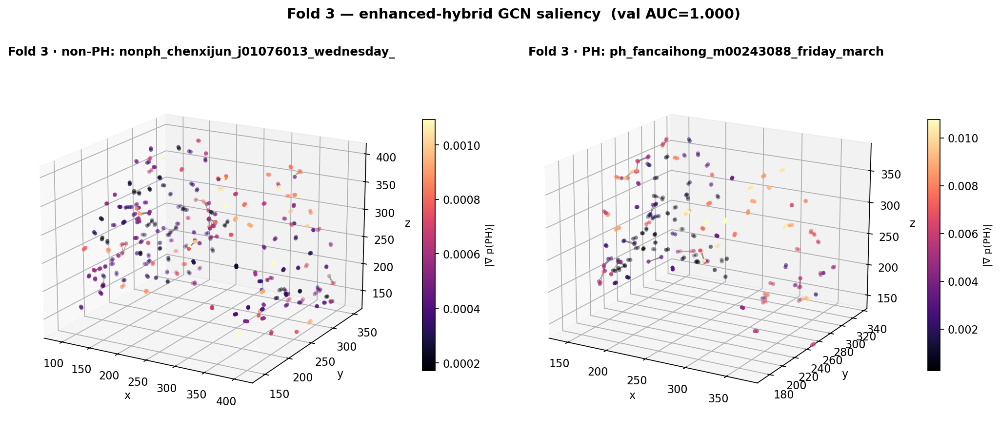
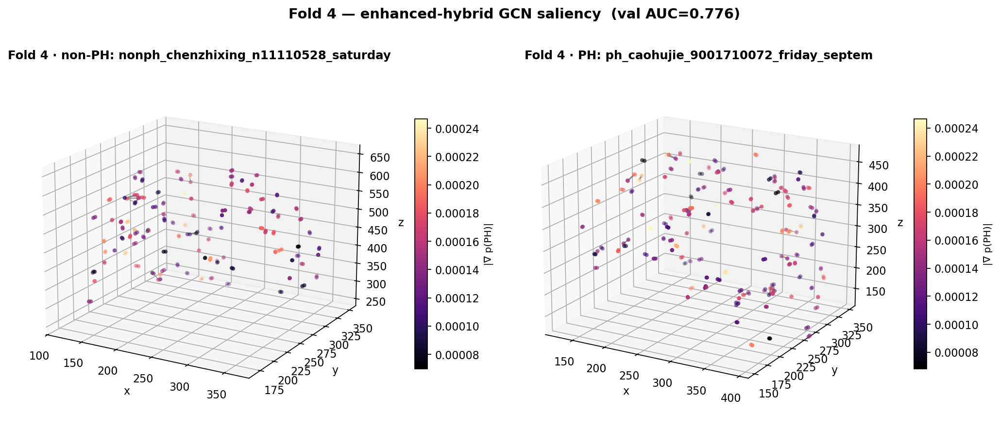
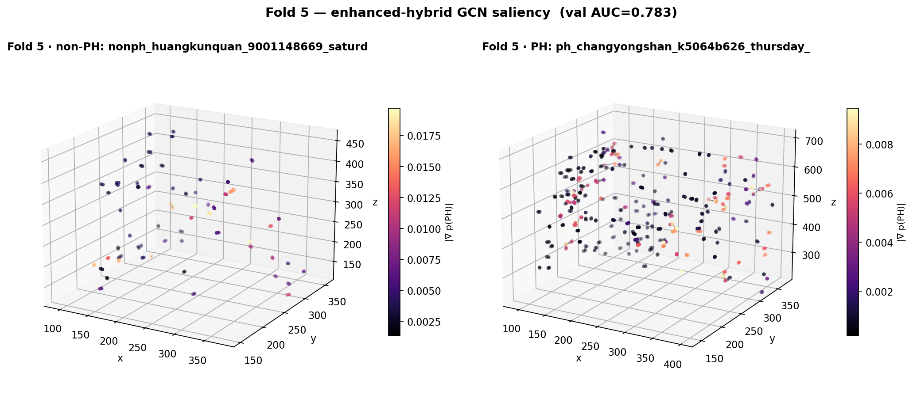

Combined 5×2 grid: [`outputs/viz_saliency_all_folds.png`](outputs/viz_saliency_all_folds.png)

### Why do folds 4 & 5 underperform? — mPAP audit

Gold standard: COPD-PH iff mPAP > 20 mmHg (resting). For each fold's val set we
joined the case_id back to the patient excel, recovered mPAP, and asked: are
folds 4/5 dominated by borderline (mPAP ≈ 20) cases?

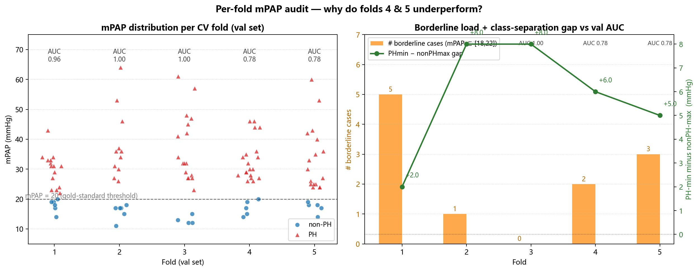

| Fold | val AUC | n_val (matched) | n_PH | n_nonPH | nonPH max mPAP | PH min mPAP | gap | borderline ∈[18,22] |
|---|---|---|---|---|---|---|---|---|
| 1 | 0.96 | 21 | 15 | 6 | 20 | 22 | **+2.0** | 5 |
| 2 | 1.00 | 17 | 11 | 6 | 18 | 26 | +8.0 | 1 |
| 3 | 1.00 | 21 | 17 | 4 | 15 | 23 | +8.0 | 0 |
| 4 | 0.78 | 24 | 19 | 5 | 20 | 26 | +6.0 | 2 |
| 5 | 0.78 | 22 | 17 | 5 | 19 | 24 | +5.0 | 3 |

**Findings (audit script: `analyze_folds_mpap.py`):**

1. **Labels are clean** — case_id prefix ↔ excel `PH` column agree on every
   matched case (0 mismatches across 105 val cases).
2. **Borderline density does not explain the gap.** Fold 1 has the *most*
   borderline overlap (gap = +2 mmHg, 5 borderline cases) yet still hits
   AUC = 0.96. Folds 4/5 have moderate borderline load (2–3 cases) and
   reasonably wide separation gaps (+5/+6 mmHg).
3. **Class imbalance is the dominant likely driver.** Folds 4 & 5 have only
   5 nonPH cases each (~20% negatives) — a single misclassified negative
   pushes specificity down by 0.20 and AUC noticeably. Folds 2/3 had cleaner
   negative-class examples (max mPAP ≤ 18, well below threshold).
4. **Individual variation, not threshold ambiguity.** In fold 5 the lowest
   PH case is at mPAP = 24 (clearly above 20) and the highest non-PH is at
   19 — clinically separable. The remaining errors are vessel-graph features
   for *clinically* clear-cut PH cases that nonetheless look atypical to the
   GCN. See `outputs/viz_saliency_fold5.png` for which nodes drive the
   prediction.

So the answer to "is it threshold-borderline cases?" is **no** — it's a
combination of (i) very few negatives in folds 4/5 inflating the variance of
specificity-driven AUC, and (ii) a few PH cases whose pulmonary vessel graph
geometry is atypical. Per-case mPAP is in `outputs/fold_mpap_audit.xlsx`.

## Repo layout

```
.
├── config.yaml                 # pipeline + training hyperparameters
├── hybrid_gcn.py               # HybridGCN(radiomics_only | gcn_only | hybrid)
├── gcn_models.py               # GCN backbones
├── graph_builder.py            # vessel tree → PyG graph
├── quantification.py           # vessel-segment geometric descriptors
├── skeleton.py                 # CT mask → centerline skeleton
├── enhance_features.py         # 12D → 16D node-feature enhancement
├── extract_radiomics.py        # commercial radiomics loader
├── run_hybrid.py               # Sprint 1: 5-fold CV, 3 modes
├── run_sprint2.py              # Sprint 2: baseline vs enhanced × 3 modes
├── run_demo.py, main.py        # smoke + full pipeline entry points
├── visualize.py                # group stats + 3D trees + saliency
├── make_report.py              # radar chart + xlsx summary
├── utils/                      # shared pipeline utilities
└── outputs/
    ├── sprint2_results.json    # raw fold metrics
    ├── sprint2_metrics.xlsx    # mean ± std summary
    ├── sprint2_radar*.png      # 6-metric radar charts
    └── viz_*.png               # interpretability plots
```

## Training pipeline

1. **Preprocess** CT masks → 3D vessel skeleton → PyG graph (`skeleton.py`,
   `graph_builder.py`, `quantification.py`) → cache as `cache/<case_id>.pkl`.
2. **Enhance** (optional) — augment 12D node features with commercial
   fractal / density / volume terms (`enhance_features.py`).
3. **Train** 5-fold CV across `{radiomics_only, gcn_only, hybrid}` × baseline/
   enhanced (`run_sprint2.py`).
4. **Visualize** (`visualize.py`): group stats, 3D trees, saliency.
5. **Report** (`make_report.py`): radar chart + xlsx summary.

Example (remote):

```bash
conda activate pulmonary_bv5_py39
CUDA_VISIBLE_DEVICES=0 python run_sprint2.py \
    --labels  "/.../labels.csv" \
    --splits  "/.../folds" \
    --output_dir outputs/sprint2_enhanced --epochs 200

python visualize.py \
    --labels "/.../labels.csv" \
    --splits "/.../folds" \
    --output_dir outputs/viz --epochs 120

python make_report.py
```

## Data & privacy

No patient-level data (CSV / cache pkls / xlsx) is committed. The user must
supply:

- `data/copd_ph_radiomics.csv` — 45-col commercial radiomics
- `cache/<case_id>.pkl` — per-patient PyG graphs
- `labels.csv` + `splits/folds/fold_{1..5}/{train,val}.txt`

## Dependencies

Python 3.9, PyTorch 2.x, `torch_geometric`, pandas, numpy, matplotlib,
scikit-learn, scipy, openpyxl. See `pulmonary_bv5_py39` conda env on the
training server for exact versions.


## Sprint 4 — gated fusion + A/V node flag

Two orthogonal P1 upgrades on top of sprint 3's `focal_local4` best arm:

| Arm | Change | Layer |
|---|---|---|
| **4a — gated fusion** | replace `concat(graph_emb, rad_emb)` with `gate * graph + (1-gate) * proj(rad)` | fusion layer |
| **4b — A/V node flag** | append a 3-valued flag per node (artery=+1 / vein=-1 / none=0) looked up from commercial `artery.nii.gz` & `vein.nii.gz` masks | information layer |

The A/V flag comes from a one-shot preprocess (`_build_av_lookup.py`) that
rasterises each cached node's voxel coordinates against the 512×512×442
commercial artery/vein masks; 4a and 4b otherwise reuse the sprint 3 config
(focal γ=2, CB-weighted α, `globals_keep=local4`, Youden threshold, 5-fold CV).

### Cross-arm comparison (enhanced feature set)


### Bar chart (enhanced / hybrid)

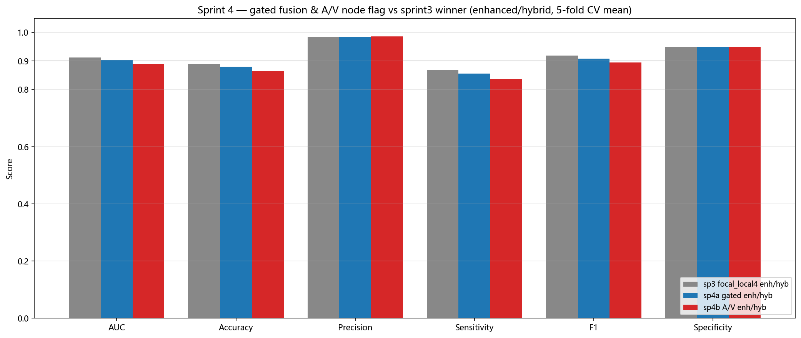

Full 18-row table: [`outputs/sprint4_vs_sprint3.xlsx`](outputs/sprint4_vs_sprint3.xlsx).

Reproduce:

```bash
# arm 4a  (GPU 0) — gated fusion only
python run_sprint3.py --cache_dir ./cache \
    --radiomics ./data/copd_ph_radiomics.csv \
    --labels <labels.csv> --splits <splits_dir> \
    --output_dir ./outputs/sprint4a_gated \
    --epochs 300 --batch_size 8 --lr 1e-3 \
    --loss focal --globals_keep local4 --fusion gated

# arm 4b  (GPU 1) — A/V flag, concat fusion
python _build_av_lookup.py --cache_dir ./cache \
    --nii_root <nii_root> --out ./outputs/sprint4b_av/av_lookup.pt
python run_sprint3.py --cache_dir ./cache \
    --radiomics ./data/copd_ph_radiomics.csv \
    --labels <labels.csv> --splits <splits_dir> \
    --output_dir ./outputs/sprint4b_av \
    --epochs 300 --batch_size 8 --lr 1e-3 \
    --loss focal --globals_keep local4 --fusion concat \
    --av_lookup ./outputs/sprint4b_av/av_lookup.pt
```

---

## Sprint 6 — tri-structure GCN (artery / vein / airway)

End-to-end tri-structure GCN with attention fusion across the three pulmonary
anatomies, replacing the radiomics + graph hybrid with a single-pipeline model.
Ten variants were run (5-fold × 3-rep CV, `mpap_aux` on) across cohort size
`{n=106 gold, n=269 expanded}`, pool mode `{mean, attn, add}`, optional
signature view, and an LR sweep `{5e-4, 1e-3, 2e-3}` on the top config.

### Headline — AUC across all 10 variants


| rank | model | n | AUC | F1 | Sens | Spec |
|---|---|---|---|---|---|---|
| 1 | `arm_a_ensemble` (sprint 5 baseline) | 113 | **0.944** | – | – | – |
| 2 | **`p_theta_269_lr2x`** (tri_structure best) | 269 | **0.928 ± 0.027** | 0.907 | 0.927 | 0.822 |
| 3 | `p_zeta_sig` (signature view, default lr) | 269 | 0.923 ± 0.034 | 0.918 | 0.933 | 0.844 |
| 4 | `p_zeta_attn` / `p_zeta_tri_282` | 269 | 0.917 | 0.911 / 0.908 | 0.94 / 0.94 | 0.81 / 0.80 |

The tri-structure pipeline at its best (`p_theta_269_lr2x`) lands **~1.6 pts
below** the radiomics ensemble baseline (0.944), but with a single end-to-end
model (no manual feature stack) and with lower variance than the n=106
sprint 5 runs.

### LR sensitivity — cohort size dominates


1. **n=269 > n=106 by ~0.23 AUC** regardless of LR — the expanded cohort
   crosses a stability threshold the tri-structure attention model needs.
2. **lr=2e-3 beats the 1e-3 default by +0.011 AUC at n=269** (0.928 vs 0.917),
   same variance. Promoted to new canonical LR.
3. **`pool_mode=attn` is catastrophic on n=106** (AUC 0.697) but matches
   `mean` on n=269 — attention heads need more samples per parameter.

### Promoted config for next sprint

```bash
python tri_structure_pipeline.py \
    --cache_dir ./cache_tri_converted \
    --labels ./data/labels_expanded_282.csv \
    --output_dir ./outputs/p_theta_269_lr2x \
    --epochs 200 --repeats 3 --lr 2e-3 \
    --mpap_aux --pool_mode mean
```

Full analysis (10-variant table, per-fold variance, retirement list):
[`outputs/_drivers_sprint6/sprint6_tri_structure_summary.md`](outputs/_drivers_sprint6/sprint6_tri_structure_summary.md).

---

## Topology evolution — does unsupervised topology alone separate PH?

The Sprint 6 GCN is *supervised* — any cluster structure in its embeddings could
just be a memorised decision boundary. A cleaner question is:

> Strip the PH label. Does pulmonary-tree topology on its own organise cases
> along the PH axis?

Three label-free views of each patient's (artery, vein, airway) graphs were
built on the n=269 cohort and clustered with KMeans / SpectralClustering
(k ∈ {2,3,4}). ARI vs the held-out PH label is used only as external
validation — never during training.

| view | signature | dim |
|---|---|---|
| **A — WL kernel** | Weisfeiler-Lehman subtree hashing (T=3), bag-of-subtrees → TruncatedSVD | 64 |
| **B — graph stats** | 19 per-structure scalars × 3 structures (degree / diameter / length / tortuosity / Strahler) | 57 |
| **C — GAE (SSL)** | per-structure `GCNConv(12→64→32)` autoencoder, BCE edge recon, 2-seed ensemble | 96 |

### Raw n=269 result — looks promising but is confounded

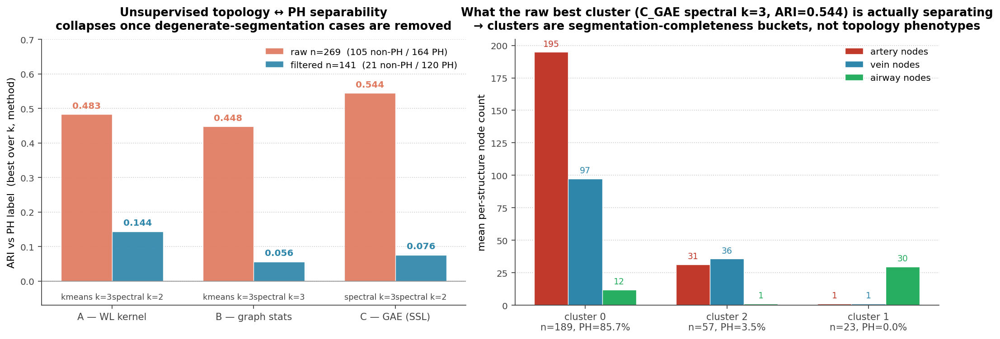

Raw best is **C_GAE spectral k=3, ARI 0.544**. Inspecting the three clusters
tells a different story than "topology phenotype":

| cluster | n | PH rate | mean artery nodes | mean vein nodes | mean airway nodes |
|---|---:|---:|---:|---:|---:|
| 0 | 189 | **85.7%** | 195 | 97 | 12 |
| 2 | 57 | 3.5% | 31 | 36 | **1** |
| 1 | 23 | 0.0% | **1** | **1** | 30 |

Clusters 1 and 2 are *segmentation failure modes* (only the airway, or only the
vessels, have non-trivial trees). They're tagged non-PH simply because the
segmentation-failed scans happen to be the healthier ones. The 0.544 ARI is
therefore a **data-quality artifact, not a topology signal**.

### Filtered n=141 — the honest answer

Keeping only cases with all three trees non-degenerate
(`artery_n ≥ 20 AND vein_n ≥ 20 AND airway_n ≥ 5`) leaves 141 / 269 cases
(120 PH / 21 non-PH, base rate 85.1%). Best ARI per view:

| view | best (method, k) | ARI | NMI | silhouette |
|---|---|---:|---:|---:|
| A — WL kernel | spectral k=2 | **0.144** | 0.043 | 0.231 |
| B — graph stats | spectral k=3 | 0.056 | 0.052 | 0.120 |
| C — GAE (SSL) | spectral k=2 | 0.076 | 0.087 | 0.368 |

Once the segmentation artifact is removed, **no unsupervised view separates PH
above chance on the clean sub-cohort**. The WL kernel still edges the other
two, but an ARI of 0.14 with 85% base-rate imbalance means the structure it
picks up is not PH-specific.

### What this says about the project

- The supervised tri-structure GCN's AUC ~0.92 is *not* recoverable from
  topology alone without labels — PH topology is **not a dominant axis of
  unsupervised variation** in this cohort.
- Segmentation-quality auditing should be a mandatory first gate on any future
  unsupervised analysis here; otherwise any reported cluster/ARI is suspect.
- For the "from COPD to COPD-PH topological evolution" question, the next
  productive direction is **supervised contrastive or weakly-label-conditioned
  representation learning**, not pure SSL clustering.

Scripts & artifacts:
- remote runner: `_remote_topology_evolution.py` (dual-GPU GAE ensemble + joblib WL/stats)
- local filtered re-analysis: `_remote_topology_evolution_filtered.py`
- figure driver: [`outputs/_drivers_sprint6/make_topology_evolution_figs.py`](outputs/_drivers_sprint6/make_topology_evolution_figs.py)
- summaries: `outputs/p_zeta_cluster_269/topology_evolution/topo_summary{,_filtered}.json`

---
