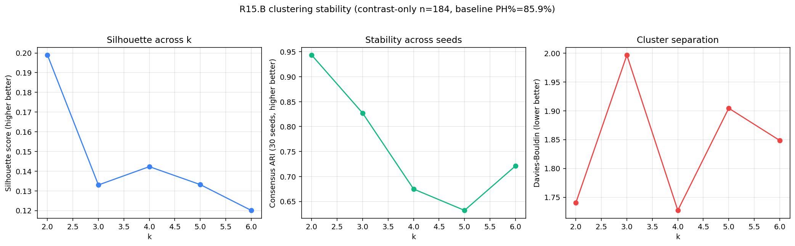

# R15.B — Clustering stability sweep

Contrast-only cohort (n=184, n_features=99, baseline PH%=85.9%). Sweep k=2..6.

| k | silhouette | calinski-harabasz | davies-bouldin | consensus ARI (30 seeds) | sig-enriched/depleted clusters |
|---|---|---|---|---|---|
| 2 | 0.199 | 48 | 1.741 | 0.943 | 2/2 |
| 3 | 0.133 | 37 | 1.996 | 0.827 | 1/3 |
| 4 | 0.142 | 31 | 1.727 | 0.675 | 1/4 |
| 5 | 0.133 | 28 | 1.904 | 0.632 | 3/5 |
| 6 | 0.120 | 26 | 1.848 | 0.721 | 4/6 |

**Best k by consensus ARI**: k=2 (ARI=0.943, silhouette=0.199).

## Cluster-PH enrichment per k (binomial test vs baseline)

### k=2

| cluster | n | n_PH | PH% | binom p (vs baseline) | enriched | depleted |
|---|---|---|---|---|---|---|
| C0 | 58 | 41 | 70.7% | 0.00228 |  | ✓ |
| C1 | 126 | 117 | 92.9% | 0.021 | ✓ |  |

### k=3

| cluster | n | n_PH | PH% | binom p (vs baseline) | enriched | depleted |
|---|---|---|---|---|---|---|
| C0 | 37 | 34 | 91.9% | 0.475 |  |  |
| C1 | 45 | 32 | 71.1% | 0.00883 |  | ✓ |
| C2 | 102 | 92 | 90.2% | 0.255 |  |  |

### k=4

| cluster | n | n_PH | PH% | binom p (vs baseline) | enriched | depleted |
|---|---|---|---|---|---|---|
| C0 | 101 | 92 | 91.1% | 0.153 |  |  |
| C1 | 4 | 1 | 25.0% | 0.0101 |  | ✓ |
| C2 | 46 | 35 | 76.1% | 0.0854 |  |  |
| C3 | 33 | 30 | 90.9% | 0.615 |  |  |

### k=5

| cluster | n | n_PH | PH% | binom p (vs baseline) | enriched | depleted |
|---|---|---|---|---|---|---|
| C0 | 30 | 27 | 90.0% | 0.792 |  |  |
| C1 | 42 | 41 | 97.6% | 0.0245 | ✓ |  |
| C2 | 4 | 1 | 25.0% | 0.0101 |  | ✓ |
| C3 | 71 | 62 | 87.3% | 0.865 |  |  |
| C4 | 37 | 27 | 73.0% | 0.0327 |  | ✓ |

### k=6

| cluster | n | n_PH | PH% | binom p (vs baseline) | enriched | depleted |
|---|---|---|---|---|---|---|
| C0 | 29 | 29 | 100.0% | 0.0276 | ✓ |  |
| C1 | 37 | 26 | 70.3% | 0.0146 |  | ✓ |
| C2 | 38 | 37 | 97.4% | 0.0358 | ✓ |  |
| C3 | 27 | 24 | 88.9% | 1 |  |  |
| C4 | 4 | 1 | 25.0% | 0.0101 |  | ✓ |
| C5 | 49 | 41 | 83.7% | 0.68 |  |  |

